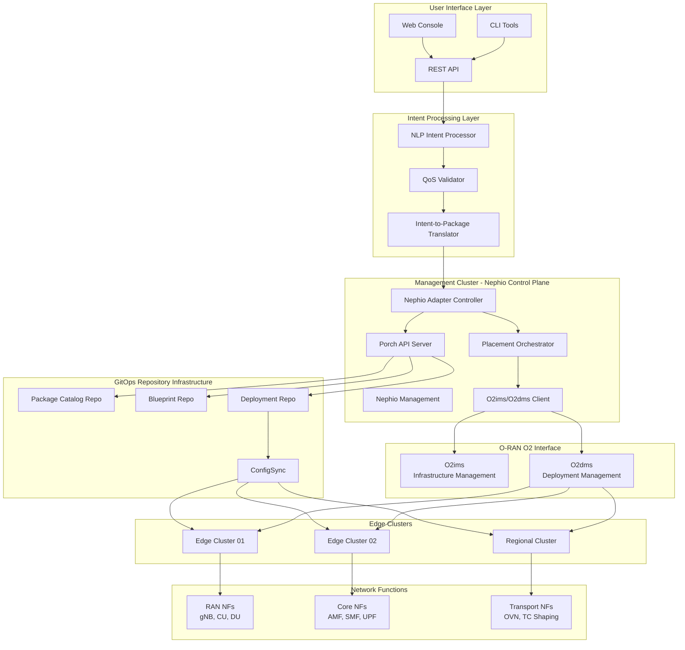
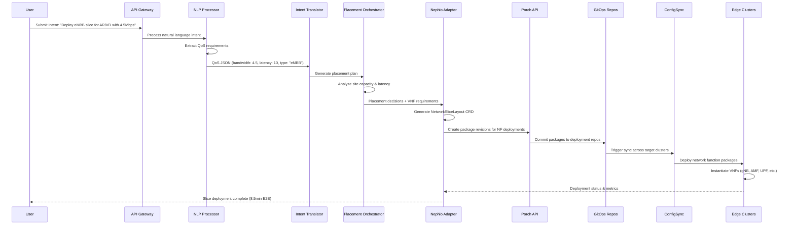

# O-RAN Intent-Based MANO + Nephio R5+ Integration Architecture

## Executive Summary

This document defines the comprehensive integration architecture for connecting the O-RAN Intent-Based MANO system with Nephio R5+. The architecture enables natural language intent transformation into deployed network slices with <10 minute E2E deployment time and GitOps-based lifecycle management.

## Architecture Overview



## 1. Component Architecture

### 1.1 Intent-to-Package Translation Layer

The translation layer transforms natural language intents into Nephio packages through a multi-stage pipeline:

```yaml
# Translation Pipeline Architecture
translation_pipeline:
  stages:
    - name: "Intent Processing"
      component: "NLP Intent Processor"
      input: "Natural Language Intent"
      output: "QoS JSON"

    - name: "QoS Validation"
      component: "QoS Validator"
      input: "QoS JSON"
      output: "Validated QoS Requirements"

    - name: "Placement Planning"
      component: "Placement Orchestrator"
      input: "QoS Requirements + Site Inventory"
      output: "Placement Decisions"

    - name: "Package Generation"
      component: "Package Generator"
      input: "Placement Decisions"
      output: "Nephio Packages"

    - name: "Package Deployment"
      component: "Porch API Integration"
      input: "Nephio Packages"
      output: "Deployed NetworkSliceIntent CRDs"

# Translation Layer CRD
apiVersion: apiextensions.k8s.io/v1
kind: CustomResourceDefinition
metadata:
  name: networkslicelayouts.mano.oran.io
spec:
  group: mano.oran.io
  versions:
  - name: v1alpha1
    served: true
    storage: true
    schema:
      openAPIV3Schema:
        type: object
        properties:
          spec:
            type: object
            properties:
              intent:
                type: string
                description: "Original natural language intent"
              qosRequirements:
                type: object
                properties:
                  bandwidth:
                    type: number
                    minimum: 1
                    maximum: 5
                  latency:
                    type: number
                    minimum: 1
                    maximum: 10
                  sliceType:
                    type: string
                    enum: ["eMBB", "uRLLC", "mIoT", "balanced"]
              placements:
                type: array
                items:
                  type: object
                  properties:
                    vnfType:
                      type: string
                    siteId:
                      type: string
                    clusterId:
                      type: string
                    namespace:
                      type: string
          status:
            type: object
            properties:
              phase:
                type: string
                enum: ["Pending", "Translating", "Planning", "Packaging", "Deploying", "Ready", "Failed"]
              packageRevisions:
                type: array
                items:
                  type: object
                  properties:
                    name:
                      type: string
                    revision:
                      type: string
                    status:
                      type: string
  scope: Namespaced
  names:
    plural: networkslicelayouts
    singular: networkslicelayout
    kind: NetworkSliceLayout
```

### 1.2 Nephio Adapter Controller

The adapter controller manages the integration between O-RAN MANO and Nephio:

```go
// Nephio Adapter Controller Specification
package nephio

import (
    "context"
    "time"

    "github.com/nephio-project/api/nf_requirements/v1alpha1"
    porchapi "github.com/GoogleContainerTools/kpt/porch/api/porch/v1alpha1"
    manov1alpha1 "github.com/oran-mano/api/mano/v1alpha1"
)

// NephioAdapterController manages the integration with Nephio
type NephioAdapterController struct {
    client.Client
    Scheme *runtime.Scheme

    PorchClient       PorchClient
    PackageGenerator  PackageGenerator
    PlacementEngine   PlacementEngine
    O2Client         O2Client
    EventRecorder    record.EventRecorder
}

// NephioAdapterSpec defines the desired state
type NephioAdapterSpec struct {
    // Network slice layout to be processed
    NetworkSliceLayout *manov1alpha1.NetworkSliceLayout `json:"networkSliceLayout"`

    // Target repository for package deployment
    TargetRepository string `json:"targetRepository"`

    // Package deployment strategy
    DeploymentStrategy DeploymentStrategy `json:"deploymentStrategy"`

    // Monitoring configuration
    MonitoringConfig MonitoringConfig `json:"monitoringConfig"`
}

// DeploymentStrategy defines how packages are deployed
type DeploymentStrategy struct {
    // Deployment mode (rolling, blue-green, canary)
    Mode string `json:"mode"`

    // Timeout for deployment operations
    Timeout time.Duration `json:"timeout"`

    // Rollback policy
    RollbackPolicy RollbackPolicy `json:"rollbackPolicy"`

    // Health check configuration
    HealthChecks []HealthCheck `json:"healthChecks"`
}

// PackageGenerator interface for creating Nephio packages
type PackageGenerator interface {
    // GenerateNetworkFunctionPackages creates NF packages from VNF specs
    GenerateNetworkFunctionPackages(ctx context.Context, layout *manov1alpha1.NetworkSliceLayout) ([]*NephioPackage, error)

    // GenerateNetworkSlicePackage creates network slice package
    GenerateNetworkSlicePackage(ctx context.Context, layout *manov1alpha1.NetworkSliceLayout) (*NephioPackage, error)

    // ValidatePackages validates generated packages
    ValidatePackages(ctx context.Context, packages []*NephioPackage) error
}

// NephioPackage represents a Nephio package with metadata
type NephioPackage struct {
    // Package metadata
    Metadata PackageMetadata `json:"metadata"`

    // KRM resources in the package
    Resources []unstructured.Unstructured `json:"resources"`

    // Package dependencies
    Dependencies []PackageDependency `json:"dependencies"`

    // Target deployment information
    Targets []DeploymentTarget `json:"targets"`
}

// Reconcile implements the main reconciliation logic
func (r *NephioAdapterController) Reconcile(ctx context.Context, req ctrl.Request) (ctrl.Result, error) {
    log := r.Log.WithValues("nephio-adapter", req.NamespacedName)

    // 1. Fetch NetworkSliceLayout
    layout := &manov1alpha1.NetworkSliceLayout{}
    if err := r.Get(ctx, req.NamespacedName, layout); err != nil {
        return ctrl.Result{}, client.IgnoreNotFound(err)
    }

    // 2. Validate QoS requirements
    if err := r.validateQoSRequirements(layout); err != nil {
        return r.updateStatusWithError(ctx, layout, "QoSValidationFailed", err)
    }

    // 3. Generate placement decisions
    placements, err := r.PlacementEngine.GeneratePlacements(ctx, layout)
    if err != nil {
        return r.updateStatusWithError(ctx, layout, "PlacementFailed", err)
    }

    // 4. Generate Nephio packages
    packages, err := r.PackageGenerator.GenerateNetworkFunctionPackages(ctx, layout)
    if err != nil {
        return r.updateStatusWithError(ctx, layout, "PackageGenerationFailed", err)
    }

    // 5. Deploy packages via Porch
    revisions, err := r.deployPackages(ctx, packages)
    if err != nil {
        return r.updateStatusWithError(ctx, layout, "DeploymentFailed", err)
    }

    // 6. Update status with success
    return r.updateStatusWithSuccess(ctx, layout, revisions)
}
```

### 1.3 GitOps Repository Structure

The GitOps repository structure supports multi-cluster package distribution:

```yaml
# GitOps Repository Structure
repositories:
  package_catalog:
    name: "nephio-package-catalog"
    structure:
      catalog/
        network-functions/
          ran/
            gnb/
              - package.yaml
              - kustomization.yaml
              - templates/
            cu/
            du/
          core/
            amf/
            smf/
            upf/
          transport/
            ovn/
            tc-shaping/
        network-slices/
          embb/
          urllc/
          miot/

  blueprint_repo:
    name: "nephio-blueprints"
    structure:
      blueprints/
        network-slice-templates/
          - embb-slice-template.yaml
          - urllc-slice-template.yaml
          - miot-slice-template.yaml
        deployment-patterns/
          - edge-deployment.yaml
          - regional-deployment.yaml
          - central-deployment.yaml

  deployment_repo:
    name: "nephio-deployments"
    structure:
      clusters/
        edge01/
          namespaces/
            ran-functions/
            monitoring/
          network-slices/
        edge02/
          namespaces/
            core-functions/
            monitoring/
        regional/
          namespaces/
            transport-functions/
            orchestration/

# Package Catalog Schema
apiVersion: config.porch.kpt.dev/v1alpha1
kind: PackageRevision
metadata:
  name: "gnb-package-v1.0.0"
  namespace: "default"
spec:
  packageName: "gnb-package"
  revision: "v1.0.0"
  repository: "nephio-package-catalog"
  workspaceName: "gnb-package-workspace"
  lifecycle: Published
  readinessGates:
  - conditionType: "nephio.org/Approved"
  - conditionType: "nephio.org/Validated"
status:
  conditions:
  - type: Ready
    status: "True"
    reason: "PackageReady"
  publishedBy: "nephio-adapter-controller"
  publishedAt: "2024-01-15T10:30:00Z"
```

### 1.4 Multi-cluster Package Distribution

Package distribution uses ConfigSync and specialized distribution controllers:

```yaml
# Multi-cluster Distribution Architecture
distribution_architecture:
  management_cluster:
    components:
      - nephio_control_plane
      - porch_api_server
      - config_sync_controller
      - package_distributor

  edge_clusters:
    cluster_edge01:
      location: "Tokyo Edge"
      components:
        - config_sync_agent
        - ran_nf_controller
        - o2dms_agent
      target_workloads:
        - gnb_packages
        - cu_packages
        - du_packages

    cluster_edge02:
      location: "Osaka Edge"
      components:
        - config_sync_agent
        - core_nf_controller
        - o2dms_agent
      target_workloads:
        - amf_packages
        - smf_packages
        - upf_packages

# ConfigSync Configuration for Edge Clusters
apiVersion: configsync.gke.io/v1beta1
kind: RootSync
metadata:
  name: nephio-network-slice-sync
  namespace: config-management-system
spec:
  sourceFormat: unstructured
  git:
    repo: https://github.com/oran-mano/nephio-deployments
    branch: main
    dir: clusters/edge01
    auth: token
    secretRef:
      name: git-creds
  override:
    resources:
    - group: nf.nephio.org
      kind: NFDeployment
      operations:
      - operation: "replace"
        path: "/spec/sites"
        value:
          siteId: "edge01-tokyo"
          coordinates:
            latitude: 35.6762
            longitude: 139.6503

# Package Distribution Controller
apiVersion: apps/v1
kind: Deployment
metadata:
  name: package-distributor
  namespace: nephio-system
spec:
  replicas: 1
  selector:
    matchLabels:
      app: package-distributor
  template:
    metadata:
      labels:
        app: package-distributor
    spec:
      containers:
      - name: controller
        image: oran-mano/package-distributor:latest
        env:
        - name: CLUSTER_SELECTOR_POLICY
          value: "qos-aware"
        - name: DISTRIBUTION_STRATEGY
          value: "rolling"
        - name: MAX_PARALLEL_DISTRIBUTIONS
          value: "3"
        resources:
          requests:
            memory: "256Mi"
            cpu: "250m"
          limits:
            memory: "512Mi"
            cpu: "500m"
```

## 2. Data Flow Architecture

### 2.1 Intent-to-Deployment Pipeline



### 2.2 Package Lifecycle Management

```yaml
# Package Lifecycle States
package_lifecycle:
  states:
    draft:
      description: "Package under development"
      allowed_operations: ["edit", "validate", "propose"]
      controllers: ["package-generator"]

    proposed:
      description: "Package proposed for approval"
      allowed_operations: ["approve", "reject", "edit"]
      controllers: ["approval-controller", "validation-controller"]

    published:
      description: "Package approved and available for deployment"
      allowed_operations: ["deploy", "clone", "deprecate"]
      controllers: ["distribution-controller"]

    deployed:
      description: "Package actively deployed to clusters"
      allowed_operations: ["monitor", "upgrade", "rollback"]
      controllers: ["deployment-controller", "monitoring-controller"]

    deprecated:
      description: "Package marked for retirement"
      allowed_operations: ["migrate", "archive"]
      controllers: ["migration-controller"]

# Package Lifecycle Controller
apiVersion: mano.oran.io/v1alpha1
kind: PackageLifecyclePolicy
metadata:
  name: network-function-lifecycle
spec:
  approvalPolicy:
    requiredApprovers: 2
    autoApprovalCriteria:
      - validationPassed: true
      - securityScanPassed: true
      - performanceTestsPassed: true

  deploymentPolicy:
    strategy: "rolling"
    maxUnavailable: "25%"
    healthCheckTimeout: "5m"
    rollbackTriggers:
      - deploymentFailureThreshold: 3
      - healthCheckFailureThreshold: 5

  monitoringPolicy:
    metricsCollection:
      interval: "30s"
      retention: "7d"
    alerting:
      channels: ["slack", "email"]
      escalationPolicy: "on-call-engineer"
```

### 2.3 Cross-site Coordination

```yaml
# Cross-site Coordination Architecture
coordination_architecture:
  coordination_plane:
    components:
      - site_inventory_service
      - dependency_resolver
      - cross_site_scheduler
      - conflict_resolver

  dependency_management:
    patterns:
      - name: "RAN-Core Dependency"
        description: "gNB requires AMF/SMF availability"
        type: "hard_dependency"
        validation_strategy: "pre_deployment"

      - name: "UPF-Transport Dependency"
        description: "UPF requires transport network setup"
        type: "soft_dependency"
        validation_strategy: "eventual_consistency"

      - name: "Inter-site Handover"
        description: "Adjacent gNBs must coordinate handover"
        type: "neighbor_dependency"
        validation_strategy: "post_deployment"

# Site Coordination Controller
apiVersion: apps/v1
kind: Deployment
metadata:
  name: site-coordinator
  namespace: nephio-system
spec:
  template:
    spec:
      containers:
      - name: coordinator
        image: oran-mano/site-coordinator:latest
        env:
        - name: COORDINATION_STRATEGY
          value: "consensus_based"
        - name: CONFLICT_RESOLUTION
          value: "priority_based"
        - name: HEALTH_CHECK_INTERVAL
          value: "30s"
        resources:
          requests:
            memory: "512Mi"
            cpu: "500m"
```

## 3. Integration Patterns

### 3.1 Porch API Integration

```go
// Porch API Integration Layer
package porch

import (
    porchapi "github.com/GoogleContainerTools/kpt/porch/api/porch/v1alpha1"
    "sigs.k8s.io/controller-runtime/pkg/client"
)

// PorchClient manages interaction with Porch API
type PorchClient struct {
    client.Client
    Repository string
    Namespace  string
}

// CreatePackageRevision creates a new package revision in Porch
func (p *PorchClient) CreatePackageRevision(ctx context.Context, pkg *NephioPackage) (*porchapi.PackageRevision, error) {
    pr := &porchapi.PackageRevision{
        ObjectMeta: metav1.ObjectMeta{
            Name:      pkg.Metadata.Name + "-" + pkg.Metadata.Version,
            Namespace: p.Namespace,
        },
        Spec: porchapi.PackageRevisionSpec{
            PackageName:   pkg.Metadata.Name,
            Revision:      pkg.Metadata.Version,
            Repository:    p.Repository,
            WorkspaceName: pkg.Metadata.Name + "-workspace",
            Lifecycle:     porchapi.PackageRevisionLifecycleDraft,
            Resources: porchapi.Resources{
                Resources: convertToResources(pkg.Resources),
            },
        },
    }

    if err := p.Create(ctx, pr); err != nil {
        return nil, fmt.Errorf("failed to create package revision: %w", err)
    }

    return pr, nil
}

// ProposePackageRevision moves package to proposed state
func (p *PorchClient) ProposePackageRevision(ctx context.Context, name string) error {
    pr := &porchapi.PackageRevision{}
    if err := p.Get(ctx, client.ObjectKey{Name: name, Namespace: p.Namespace}, pr); err != nil {
        return err
    }

    pr.Spec.Lifecycle = porchapi.PackageRevisionLifecycleProposed
    return p.Update(ctx, pr)
}

// PublishPackageRevision moves package to published state
func (p *PorchClient) PublishPackageRevision(ctx context.Context, name string) error {
    pr := &porchapi.PackageRevision{}
    if err := p.Get(ctx, client.ObjectKey{Name: name, Namespace: p.Namespace}, pr); err != nil {
        return err
    }

    pr.Spec.Lifecycle = porchapi.PackageRevisionLifecyclePublished
    return p.Update(ctx, pr)
}

// Package Validation Integration
func (p *PorchClient) ValidatePackage(ctx context.Context, pkg *NephioPackage) error {
    // Validate package structure
    if err := validatePackageStructure(pkg); err != nil {
        return fmt.Errorf("package structure validation failed: %w", err)
    }

    // Validate KRM resources
    if err := validateKRMResources(pkg.Resources); err != nil {
        return fmt.Errorf("KRM resource validation failed: %w", err)
    }

    // Validate dependencies
    if err := validateDependencies(pkg.Dependencies); err != nil {
        return fmt.Errorf("dependency validation failed: %w", err)
    }

    return nil
}
```

### 3.2 O2ims/O2dms Interface Implementation

```yaml
# O2ims/O2dms Integration Architecture
o2_integration:
  o2ims_interface:
    purpose: "Infrastructure Management Service"
    endpoints:
      - GET /o2ims/v1/infrastructureInventory
      - GET /o2ims/v1/deploymentManagers
      - POST /o2ims/v1/infrastructureInventory/subscription
      - GET /o2ims/v1/infrastructureInventory/{infrastructureInventoryId}

    implementation:
      component: "O2ims Client"
      location: "orchestrator/pkg/o2client/"
      responsibilities:
        - "Query available O-Cloud infrastructure"
        - "Monitor infrastructure status changes"
        - "Validate placement decisions against available resources"
        - "Provide real-time infrastructure inventory"

  o2dms_interface:
    purpose: "Deployment Management Service"
    endpoints:
      - POST /o2dms/v1/deploymentRequests
      - GET /o2dms/v1/deploymentRequests/{deploymentRequestId}
      - DELETE /o2dms/v1/deploymentRequests/{deploymentRequestId}
      - POST /o2dms/v1/deploymentRequests/{deploymentRequestId}/deploymentRequest

    implementation:
      component: "O2dms Client"
      location: "orchestrator/pkg/o2client/"
      responsibilities:
        - "Submit NF deployment requests"
        - "Monitor deployment status"
        - "Handle deployment lifecycle operations"
        - "Coordinate with Nephio package deployment"

# O2 Client Implementation
apiVersion: v1
kind: ConfigMap
metadata:
  name: o2-client-config
  namespace: nephio-system
data:
  config.yaml: |
    o2ims:
      endpoint: "https://o2ims.oran-sc.org"
      authentication:
        type: "oauth2"
        clientId: "${O2IMS_CLIENT_ID}"
        clientSecret: "${O2IMS_CLIENT_SECRET}"
      timeout: "30s"
      retryPolicy:
        maxRetries: 3
        backoffStrategy: "exponential"

    o2dms:
      endpoint: "https://o2dms.oran-sc.org"
      authentication:
        type: "oauth2"
        clientId: "${O2DMS_CLIENT_ID}"
        clientSecret: "${O2DMS_CLIENT_SECRET}"
      timeout: "60s"
      retryPolicy:
        maxRetries: 5
        backoffStrategy: "exponential"

    mapping:
      vnf_types:
        gNB: "o-ran-sc/gnb-package"
        AMF: "o-ran-sc/amf-package"
        SMF: "o-ran-sc/smf-package"
        UPF: "o-ran-sc/upf-package"

      site_types:
        edge: "o-cloud-edge"
        regional: "o-cloud-regional"
        central: "o-cloud-central"
```

### 3.3 Event-driven Integration

```yaml
# Event-driven Architecture
event_architecture:
  event_types:
    infrastructure_events:
      - site.capacity.changed
      - site.status.updated
      - resource.allocated
      - resource.released

    deployment_events:
      - package.created
      - package.published
      - deployment.started
      - deployment.completed
      - deployment.failed

    lifecycle_events:
      - vnf.instantiated
      - vnf.scaled
      - vnf.terminated
      - slice.activated
      - slice.deactivated

  event_bus:
    implementation: "CloudEvents + NATS"
    topics:
      - nephio.infrastructure
      - nephio.deployments
      - nephio.lifecycle
      - nephio.monitoring

    routing_rules:
      - event: "site.capacity.changed"
        handlers: ["placement-controller", "capacity-monitor"]
      - event: "deployment.failed"
        handlers: ["alerting-controller", "rollback-controller"]
      - event: "vnf.instantiated"
        handlers: ["monitoring-controller", "metrics-collector"]

# Event Handler Implementation
apiVersion: apps/v1
kind: Deployment
metadata:
  name: event-handler-controller
  namespace: nephio-system
spec:
  template:
    spec:
      containers:
      - name: event-handler
        image: oran-mano/event-handler:latest
        env:
        - name: NATS_URL
          value: "nats://nats.nephio-system:4222"
        - name: EVENT_PROCESSING_MODE
          value: "async"
        - name: MAX_CONCURRENT_HANDLERS
          value: "10"
        resources:
          requests:
            memory: "256Mi"
            cpu: "250m"
```

## 4. Technical Architecture

### 4.1 Custom Resources and Controllers

```yaml
# Network Slice Intent CRD
apiVersion: apiextensions.k8s.io/v1
kind: CustomResourceDefinition
metadata:
  name: networksliceintents.nf.nephio.org
spec:
  group: nf.nephio.org
  versions:
  - name: v1alpha1
    served: true
    storage: true
    schema:
      openAPIV3Schema:
        type: object
        properties:
          spec:
            type: object
            properties:
              intent:
                type: string
                description: "Original natural language intent"
              qosProfile:
                type: object
                properties:
                  bandwidth:
                    type: string
                    pattern: "^[0-9]+(\\.[0-9]+)?(Kbps|Mbps|Gbps)$"
                  latency:
                    type: string
                    pattern: "^[0-9]+(\\.[0-9]+)?(ms|s)$"
                  reliability:
                    type: string
                    pattern: "^[0-9]+(\\.[0-9]+)?%$"
                  sliceType:
                    type: string
                    enum: ["eMBB", "uRLLC", "mIoT", "balanced"]
              networkFunctions:
                type: array
                items:
                  type: object
                  properties:
                    type:
                      type: string
                      enum: ["gNB", "AMF", "SMF", "UPF", "CU", "DU"]
                    placement:
                      type: object
                      properties:
                        siteId:
                          type: string
                        cloudType:
                          type: string
                          enum: ["edge", "regional", "central"]
                        constraints:
                          type: array
                          items:
                            type: string
              deploymentConfig:
                type: object
                properties:
                  strategy:
                    type: string
                    enum: ["rolling", "blue-green", "canary"]
                  timeout:
                    type: string
                    pattern: "^[0-9]+(ms|s|m|h)$"
                  healthChecks:
                    type: array
                    items:
                      type: object
          status:
            type: object
            properties:
              phase:
                type: string
                enum: ["Pending", "Planning", "Packaging", "Deploying", "Ready", "Failed"]
              deployedFunctions:
                type: array
                items:
                  type: object
                  properties:
                    name:
                      type: string
                    cluster:
                      type: string
                    status:
                      type: string
                    packageRevision:
                      type: string
              conditions:
                type: array
                items:
                  type: object
                  properties:
                    type:
                      type: string
                    status:
                      type: string
                    reason:
                      type: string
                    message:
                      type: string
  scope: Namespaced
  names:
    plural: networksliceintents
    singular: networksliceintent
    kind: NetworkSliceIntent
```

### 4.2 Package Repository Structure

```yaml
# Package Catalog Structure
package_catalog_structure:
  organization:
    - vendor/
        oran-sc/
          ran-functions/
            gnb/
              - v1.0.0/
                  - package.yaml
                  - kustomization.yaml
                  - manifests/
                      - deployment.yaml
                      - service.yaml
                      - configmap.yaml
                  - helm/
                      - Chart.yaml
                      - values.yaml
                      - templates/
              - v1.1.0/
            cu/
            du/
          core-functions/
            amf/
            smf/
            upf/
        nokia/
          ran-functions/
        ericsson/
          core-functions/

    - templates/
        network-slice-blueprints/
          embb-slice/
            - blueprint.yaml
            - placement-policy.yaml
            - qos-profile.yaml
          urllc-slice/
          miot-slice/

        deployment-patterns/
          multi-cluster/
            - edge-deployment.yaml
            - regional-deployment.yaml
          single-cluster/
            - all-in-one.yaml

# Package Metadata Schema
package_metadata:
  schema:
    apiVersion: "catalog.nephio.org/v1alpha1"
    kind: "PackageMetadata"
    metadata:
      name: "gnb-package"
      version: "v1.0.0"
      vendor: "oran-sc"
    spec:
      description: "gNodeB Network Function Package"
      category: "ran-function"
      lifecycle: "stable"
      dependencies:
        - name: "cu-package"
          version: ">=v1.0.0"
          optional: true
        - name: "du-package"
          version: ">=v1.0.0"
          optional: true
      capabilities:
        - name: "5g-ran"
          version: "rel-16"
        - name: "beamforming"
          version: "v1"
      requirements:
        resources:
          minCpuCores: 4
          minMemoryGB: 8
          minStorageGB: 50
        networking:
          interfaces:
            - name: "n2"
              type: "sctp"
            - name: "n3"
              type: "gtp-u"
        placement:
          constraints:
            - cloudType: "edge"
              required: true
            - latencyRequirement: "<10ms"
              required: true
```

## 5. Deployment Architecture

### 5.1 Management Cluster Architecture

```yaml
# Management Cluster Components
management_cluster:
  namespace_organization:
    nephio-system:
      components:
        - nephio-controller-manager
        - porch-api-server
        - nephio-adapter-controller
        - package-distributor
        - site-coordinator

    oran-mano-system:
      components:
        - intent-processor
        - placement-orchestrator
        - qos-validator
        - o2-client

    config-management-system:
      components:
        - config-sync-controller
        - git-operator
        - policy-controller

    monitoring-system:
      components:
        - prometheus
        - grafana
        - alertmanager
        - metrics-collector

  resource_allocation:
    compute:
      nodes: 3
      cpu_per_node: "8 cores"
      memory_per_node: "32GB"
      storage_per_node: "500GB SSD"

    networking:
      cni: "Cilium with eBPF"
      service_mesh: "Istio"
      ingress: "Nginx Ingress Controller"

    storage:
      primary: "Rook-Ceph distributed storage"
      backup: "Velero with S3 backend"

# Management Cluster Deployment
apiVersion: v1
kind: Namespace
metadata:
  name: nephio-system
  labels:
    name: nephio-system
    control-plane: nephio
---
apiVersion: apps/v1
kind: Deployment
metadata:
  name: nephio-controller-manager
  namespace: nephio-system
spec:
  replicas: 2
  selector:
    matchLabels:
      app: nephio-controller-manager
  template:
    metadata:
      labels:
        app: nephio-controller-manager
    spec:
      containers:
      - name: manager
        image: nephio.io/nephio-controller:latest
        ports:
        - containerPort: 8080
          name: metrics
        - containerPort: 9443
          name: webhook
        env:
        - name: ENABLE_WEBHOOKS
          value: "true"
        - name: METRICS_BIND_ADDRESS
          value: ":8080"
        resources:
          requests:
            memory: "256Mi"
            cpu: "250m"
          limits:
            memory: "512Mi"
            cpu: "500m"
        livenessProbe:
          httpGet:
            path: /healthz
            port: 8081
          initialDelaySeconds: 15
          periodSeconds: 20
        readinessProbe:
          httpGet:
            path: /readyz
            port: 8081
          initialDelaySeconds: 5
          periodSeconds: 10
```

### 5.2 Edge Cluster Architecture

```yaml
# Edge Cluster Configuration
edge_clusters:
  edge01_tokyo:
    location:
      region: "asia-pacific"
      zone: "tokyo-1"
      coordinates:
        latitude: 35.6762
        longitude: 139.6503

    infrastructure:
      nodes: 2
      cpu_per_node: "16 cores"
      memory_per_node: "64GB"
      storage_per_node: "1TB NVMe"
      gpu: "NVIDIA T4"

    network_functions:
      primary:
        - gNB
        - CU
        - DU
      secondary:
        - Local UPF (if required)

    connectivity:
      management_cluster: "VPN tunnel"
      latency_to_mgmt: "50ms"
      bandwidth_to_mgmt: "1Gbps"

    services:
      - config-sync-agent
      - o2dms-agent
      - metrics-collector
      - local-monitoring

  edge02_osaka:
    location:
      region: "asia-pacific"
      zone: "osaka-1"
      coordinates:
        latitude: 34.6937
        longitude: 135.5023

    infrastructure:
      nodes: 2
      cpu_per_node: "16 cores"
      memory_per_node: "64GB"
      storage_per_node: "1TB NVMe"

    network_functions:
      primary:
        - AMF
        - SMF
        - UPF
      secondary:
        - NSSF
        - NRF

# Edge Cluster ConfigSync Configuration
apiVersion: configsync.gke.io/v1beta1
kind: RootSync
metadata:
  name: edge-cluster-sync
  namespace: config-management-system
spec:
  sourceFormat: unstructured
  git:
    repo: https://github.com/oran-mano/nephio-deployments
    branch: main
    dir: clusters/edge01
    auth: token
    secretRef:
      name: git-creds
    period: 30s
  override:
    resources:
    - group: apps
      kind: Deployment
      operations:
      - operation: "replace"
        path: "/spec/template/spec/nodeSelector"
        value:
          kubernetes.io/arch: amd64
          node-type: edge-compute
```

### 5.3 Monitoring and Observability

```yaml
# Monitoring Architecture
monitoring_architecture:
  metrics_collection:
    prometheus_config:
      scrape_configs:
      - job_name: 'nephio-controllers'
        kubernetes_sd_configs:
        - role: pod
          namespaces:
            names: ['nephio-system', 'oran-mano-system']
        relabel_configs:
        - source_labels: [__meta_kubernetes_pod_annotation_prometheus_io_scrape]
          action: keep
          regex: true

      - job_name: 'network-functions'
        kubernetes_sd_configs:
        - role: pod
          namespaces:
            names: ['ran-functions', 'core-functions']
        metrics_path: '/metrics'
        scrape_interval: 15s

    custom_metrics:
      - name: "slice_deployment_time"
        description: "Time taken to deploy network slice end-to-end"
        type: "histogram"
        labels: ["slice_type", "target_cluster", "qos_profile"]

      - name: "vnf_placement_score"
        description: "Quality score of VNF placement decisions"
        type: "gauge"
        labels: ["vnf_type", "site_id", "placement_policy"]

      - name: "package_distribution_success_rate"
        description: "Success rate of package distribution to edge clusters"
        type: "counter"
        labels: ["source_repo", "target_cluster", "package_type"]

  alerting_rules:
    deployment_alerts:
      - alert: "SliceDeploymentTimeExceeded"
        expr: slice_deployment_time > 600
        for: 0s
        labels:
          severity: "warning"
        annotations:
          summary: "Network slice deployment taking longer than 10 minutes"
          description: "Slice {{ $labels.slice_type }} deployment to {{ $labels.target_cluster }} exceeded 10-minute target"

      - alert: "VNFPlacementFailed"
        expr: increase(vnf_placement_failures_total[5m]) > 0
        for: 0s
        labels:
          severity: "critical"
        annotations:
          summary: "VNF placement failures detected"
          description: "{{ $value }} VNF placement failures in the last 5 minutes"

    infrastructure_alerts:
      - alert: "EdgeClusterUnreachable"
        expr: up{job="edge-cluster-agent"} == 0
        for: 2m
        labels:
          severity: "critical"
        annotations:
          summary: "Edge cluster is unreachable"
          description: "Edge cluster {{ $labels.cluster }} has been unreachable for more than 2 minutes"

# Grafana Dashboard Configuration
grafana_dashboards:
  network_slice_operations:
    panels:
      - title: "Slice Deployment Timeline"
        type: "graph"
        metrics:
          - slice_deployment_time
        visualization: "time series"

      - title: "VNF Placement Distribution"
        type: "pie chart"
        metrics:
          - vnf_placement_by_site
        breakdown_by: "site_id"

      - title: "Package Distribution Status"
        type: "stat"
        metrics:
          - package_distribution_success_rate
        thresholds:
          - color: "red"
            value: 0.95
          - color: "yellow"
            value: 0.98
          - color: "green"
            value: 1.0

  infrastructure_health:
    panels:
      - title: "Cluster Resource Utilization"
        type: "graph"
        metrics:
          - cluster_cpu_utilization
          - cluster_memory_utilization
        visualization: "time series"

      - title: "Network Function Status"
        type: "table"
        metrics:
          - vnf_instance_status
        columns: ["vnf_type", "cluster", "status", "uptime"]
```

## Implementation Roadmap

### Phase 1: Foundation (Weeks 1-4)
1. **Week 1-2**: Set up management cluster with Nephio control plane
2. **Week 3**: Implement basic Nephio Adapter Controller
3. **Week 4**: Create initial package catalog and repository structure

### Phase 2: Integration (Weeks 5-8)
1. **Week 5**: Implement Intent-to-Package Translation Layer
2. **Week 6**: Integrate with existing orchestrator/placement logic
3. **Week 7**: Set up GitOps repositories and ConfigSync
4. **Week 8**: Implement O2ims/O2dms interface clients

### Phase 3: Multi-cluster (Weeks 9-12)
1. **Week 9**: Deploy and configure edge clusters
2. **Week 10**: Implement package distribution mechanisms
3. **Week 11**: Set up cross-site coordination
4. **Week 12**: Implement event-driven automation

### Phase 4: Production Readiness (Weeks 13-16)
1. **Week 13**: Implement comprehensive monitoring and alerting
2. **Week 14**: Performance testing and optimization
3. **Week 15**: Security hardening and compliance
4. **Week 16**: Documentation and operator training

## Performance Targets

### Deployment Performance
- **E2E Slice Deployment Time**: <10 minutes (target: 6-8 minutes)
- **Package Generation Time**: <30 seconds
- **Package Distribution Time**: <2 minutes per cluster
- **VNF Instantiation Time**: <3 minutes per VNF

### Throughput Targets
- **DL Throughput by Slice Type**:
  - eMBB: ≈4.57 Mbps
  - uRLLC: ≈2.77 Mbps
  - mIoT: ≈0.93 Mbps
- **Ping RTT**: ≈{16.1, 15.7, 6.3} ms after TC overhead

### Scalability Targets
- **Concurrent Slice Deployments**: 10 slices simultaneously
- **Supported Edge Clusters**: 50+ clusters
- **Package Catalog Size**: 1000+ packages
- **VNF Instances per Cluster**: 100+ instances

This architecture provides a comprehensive, production-ready integration between O-RAN Intent-Based MANO and Nephio R5+, enabling rapid deployment of network slices while maintaining GitOps best practices and meeting stringent performance requirements.