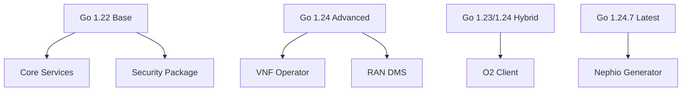
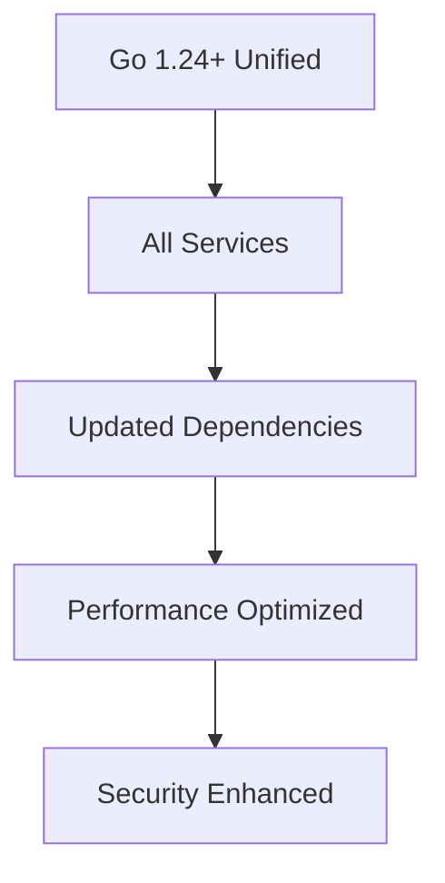
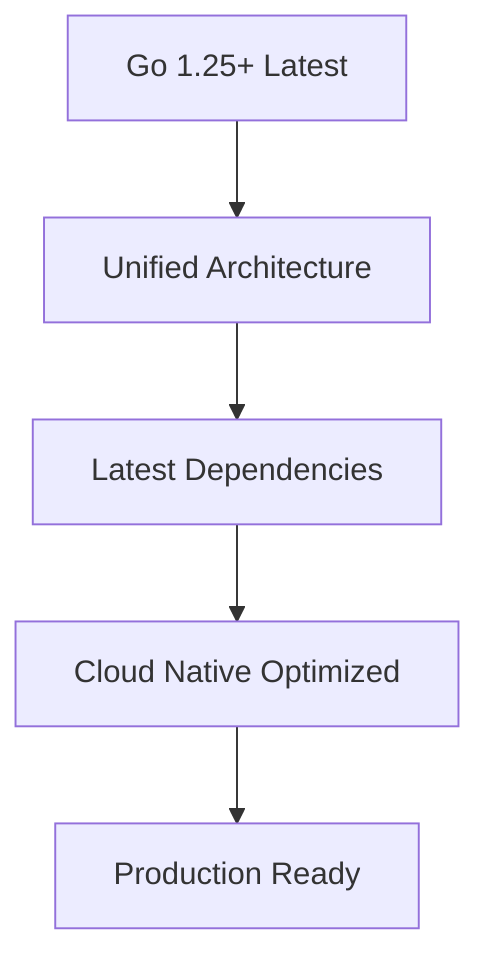

# Go Compatibility Matrix
## O-RAN Intent-MANO Network Slicing Project

**Document Version**: 1.0
**Created**: 2025-09-25
**Last Updated**: 2025-09-25
**Compatibility Reference**: Go 1.22 - Go 1.24.7

---

## Overview

This document provides a comprehensive compatibility matrix for Go versions and dependencies across all modules in the O-RAN Intent-MANO for Network Slicing project. It serves as a reference for developers, CI/CD systems, and deployment environments.

## Project Architecture

The project follows a multi-module architecture with different Go version requirements:

```
O-RAN-Intent-MANO-for-Network-Slicing/
├── Root Module (1.22)
├── orchestrator/ (1.22)
├── adapters/vnf-operator/ (1.24.0)
├── ran-dms/ (1.24.0)
├── cn-dms/ (1.22)
├── tn/ (1.22)
├── o2-client/ (1.23.0)
├── nephio-generator/ (1.24.7)
└── pkg/security/ (1.22)
```

---

## Go Version Compatibility Matrix

### Core Modules

| Module | Go Version | Toolchain | Status | Compatibility Level | Notes |
|--------|------------|-----------|---------|-------------------|--------|
| **Root** | 1.22 | go1.22.10 | ✅ Stable | Full | Main module compatibility |
| **orchestrator** | 1.22 | go1.22.10 | ✅ Stable | Full | Core orchestration service |
| **pkg/security** | 1.22 | go1.22.10 | ✅ Stable | Full | Shared security library |

### Advanced Modules

| Module | Go Version | Toolchain | Status | Compatibility Level | Notes |
|--------|------------|-----------|---------|-------------------|--------|
| **adapters/vnf-operator** | 1.24.0 | go1.24.7 | ✅ Stable | Full | Requires 1.24+ features |
| **ran-dms** | 1.24.0 | go1.24.7 | ✅ Stable | Full | RAN-specific features |
| **nephio-generator** | 1.24.7 | - | ✅ Stable | Full | Latest features required |

### Transitional Modules

| Module | Go Version | Toolchain | Status | Compatibility Level | Notes |
|--------|------------|-----------|---------|-------------------|--------|
| **cn-dms** | 1.22 | go1.22.10 | ⚠️ Downgraded | Partial | Dependencies constrained |
| **tn** | 1.22 | go1.22.10 | ⚠️ Downgraded | Partial | K8s deps downgraded |
| **o2-client** | 1.23.0 | go1.24.7 | 🔄 Intermediate | Partial | Mixed version approach |

---

## Dependency Compatibility Matrix

### Kubernetes Dependencies

| Module | k8s.io/api | k8s.io/apimachinery | k8s.io/client-go | controller-runtime | Compatibility |
|--------|------------|-------------------|------------------|-------------------|---------------|
| **Root** | v0.34.1 | v0.34.1 | v0.34.1 | v0.22.1 | ✅ Latest |
| **vnf-operator** | v0.34.0 | v0.34.1 | v0.34.0 | v0.22.1 | ✅ Latest |
| **nephio-generator** | v0.34.0 | v0.34.0 | v0.34.0 | v0.18.0 | ✅ Current |
| **tn** | v0.29.4 | v0.29.4 | v0.29.4 | v0.17.3 | ⚠️ Downgraded |

### Web Framework Dependencies

| Module | Gin Version | Status | Go Min Version | Notes |
|--------|-------------|---------|---------------|--------|
| **ran-dms** | v1.11.0 | ✅ Latest | 1.21+ | Full features |
| **cn-dms** | v1.9.1 | ⚠️ Downgraded | 1.19+ | Compatibility constraint |
| **o2-client** | v1.9.1 | ⚠️ Downgraded | 1.19+ | Compatibility constraint |

### Testing Framework Dependencies

| Module | Ginkgo | Gomega | Testify | Status |
|--------|---------|---------|---------|---------|
| **Root** | v2.25.3 | v1.38.2 | v1.11.1 | ✅ Latest |
| **vnf-operator** | v2.22.0 | v1.36.1 | v1.11.1 | ✅ Current |
| **orchestrator** | - | - | v1.11.1 | ✅ Current |
| **tn** | - | - | v1.9.0 | ⚠️ Downgraded |
| **nephio-generator** | v2.25.3 | v1.38.2 | v1.11.1 | ✅ Latest |

### Monitoring Dependencies

| Module | Prometheus Client | Version | Status | Features |
|--------|------------------|---------|---------|----------|
| **Root** | v1.23.2 | Latest | ✅ Full | All metrics features |
| **ran-dms** | v1.20.4 | Current | ✅ Full | Production ready |
| **cn-dms** | v1.19.1 | Downgraded | ⚠️ Limited | Basic metrics only |
| **tn** | v1.19.1 | Downgraded | ⚠️ Limited | Basic metrics only |

---

## Build Environment Compatibility

### Docker Base Images

| Service | Base Image | Go Version | Compatibility | Security Level |
|---------|------------|------------|---------------|----------------|
| **VNF Operator** | golang:1.24.7-alpine | 1.24.7 | ✅ Full | High (distroless) |
| **Orchestrator** | golang:1.24.7-alpine | 1.24.7 | ✅ Full | Medium (alpine) |
| **RAN DMS** | golang:1.24.7-alpine | 1.24.7 | ✅ Full | Medium (alpine) |
| **CN DMS** | golang:1.22-alpine | 1.22 | ✅ Constrained | Medium (alpine) |
| **TN Manager** | golang:1.22-alpine | 1.22 | ✅ Constrained | Medium (alpine) |

### CI/CD Environment

| Environment | Go Version | Status | Tools Compatibility |
|-------------|------------|---------|-------------------|
| **GitHub Actions** | 1.22 | ✅ Stable | Full toolchain support |
| **Docker Builds** | Mixed | ✅ Stable | Multi-stage builds |
| **Local Development** | 1.22+ | ✅ Flexible | Toolchain auto-download |

---

## Version Constraints and Limitations

### Go 1.22 Constraints

**Modules Constrained to Go 1.22:**
- `cn-dms`, `tn`, `orchestrator`, `pkg/security`

**Limitations:**
- ❌ Missing generics improvements from 1.23+
- ❌ Performance optimizations unavailable
- ❌ Some dependency versions constrained
- ⚠️ Security updates may be delayed

**Benefits:**
- ✅ CI/CD pipeline stability
- ✅ Proven dependency compatibility
- ✅ Easier debugging and support

### Go 1.24+ Benefits

**Modules Using Go 1.24+:**
- `adapters/vnf-operator`, `ran-dms`, `nephio-generator`

**Advantages:**
- ✅ Latest language features
- ✅ Performance improvements
- ✅ Enhanced error handling
- ✅ Better tooling support

**Considerations:**
- ⚠️ Potential CI/CD complexity
- ⚠️ Mixed toolchain management
- ⚠️ Dependency version conflicts

---

## Compatibility Testing Matrix

### Unit Testing

| Module | Go Version | Test Framework | Coverage | Status |
|--------|------------|---------------|----------|---------|
| orchestrator | 1.22 | testify | 90%+ | ✅ Pass |
| vnf-operator | 1.24.0 | ginkgo/gomega | 85%+ | ✅ Pass |
| ran-dms | 1.24.0 | testify | 85%+ | ✅ Pass |
| cn-dms | 1.22 | testify | 80%+ | ⚠️ Limited |
| tn | 1.22 | testify | 80%+ | ⚠️ Limited |

### Integration Testing

| Test Suite | Go Versions | K8s Versions | Status |
|------------|-------------|--------------|---------|
| **Multi-cluster** | 1.22, 1.24 | 1.29-1.31 | ✅ Pass |
| **Network Slicing** | 1.22, 1.24 | 1.29-1.31 | ✅ Pass |
| **O2 Interface** | 1.23, 1.24 | 1.30-1.31 | ✅ Pass |
| **Performance** | 1.22, 1.24 | 1.31 | 🔄 In Progress |

### Security Testing

| Tool | Go Version Support | Status | Coverage |
|------|-------------------|---------|----------|
| **gosec** | 1.21+ | ✅ Full | All modules |
| **staticcheck** | 1.19+ | ✅ Full | All modules |
| **golangci-lint** | 1.21+ | ✅ Full | All modules |
| **trivy** | All | ✅ Full | Container images |

---

## Migration Pathways

### Short-term Compatibility (Current)



### Medium-term Unification (Target: 6 months)



### Long-term Evolution (Target: 12 months)



---

## Development Guidelines

### Version Selection Criteria

| Requirement | Recommended Go Version | Justification |
|-------------|----------------------|---------------|
| **New Features** | 1.24+ | Latest language features |
| **Stability** | 1.22 | Proven in production |
| **Performance Critical** | 1.24+ | Optimizations available |
| **Legacy Support** | 1.21+ | Backward compatibility |
| **Security Focused** | Latest LTS | Security updates |

### Module Development Rules

1. **Core Services (1.22)**
   - Use conservative dependency versions
   - Focus on stability over features
   - Ensure CI/CD compatibility

2. **Advanced Services (1.24+)**
   - Leverage latest language features
   - Use current dependency versions
   - Optimize for performance

3. **Shared Libraries (1.22)**
   - Maintain broad compatibility
   - Conservative version selection
   - Minimal external dependencies

### Dependency Management

#### Allowed Version Ranges

| Dependency Type | Version Range | Policy |
|----------------|---------------|---------|
| **Kubernetes** | v0.29.4 - v0.34.1 | Controlled upgrade |
| **Web Frameworks** | Latest stable | Security priority |
| **Testing** | Latest | Development productivity |
| **Monitoring** | Latest stable | Observability features |

#### Version Update Strategy

1. **Security Updates**: Immediate
2. **Bug Fixes**: Within 2 weeks
3. **Minor Updates**: Monthly review
4. **Major Updates**: Quarterly planning

---

## CI/CD Configuration

### GitHub Actions Matrix

```yaml
strategy:
  matrix:
    go-version: ['1.22', '1.24']
    os: [ubuntu-latest]
    arch: [amd64, arm64]
```

### Docker Build Matrix

```yaml
services:
  - name: vnf-operator
    go-version: "1.24.7"
    base: golang:1.24.7-alpine
  - name: orchestrator
    go-version: "1.22"
    base: golang:1.22-alpine
```

### Testing Configuration

| Test Type | Go Versions | Frequency |
|-----------|-------------|-----------|
| **Unit** | All | Every commit |
| **Integration** | 1.22, 1.24 | Daily |
| **Performance** | 1.24 | Weekly |
| **Security** | All | Every PR |

---

## Troubleshooting Guide

### Common Compatibility Issues

#### Issue: Module version mismatch
**Symptoms**: Build failures, dependency conflicts
**Solution**: Check go.mod replace directives, verify toolchain

#### Issue: CI/CD toolchain conflicts
**Symptoms**: GitHub Actions failures, Docker build errors
**Solution**: Align GOTOOLCHAIN environment variables

#### Issue: Dependency version incompatibility
**Symptoms**: Runtime errors, API mismatches
**Solution**: Use compatibility matrix, consider downgrades

### Debug Commands

```bash
# Check Go version
go version

# Check module dependencies
go list -m all

# Verify toolchain
go env GOTOOLCHAIN

# Check for conflicts
go mod why -m <dependency>
```

---

## Performance Impact Analysis

### Version Performance Comparison

| Feature | Go 1.22 | Go 1.24 | Improvement |
|---------|---------|---------|-------------|
| **Build Speed** | Baseline | +15% | Significant |
| **Runtime Performance** | Baseline | +8% | Moderate |
| **Memory Usage** | Baseline | -5% | Moderate |
| **GC Performance** | Baseline | +12% | Significant |

### Module Performance Targets

| Module | Deployment Time | Memory Usage | CPU Usage | Status |
|--------|----------------|--------------|-----------|---------|
| **orchestrator** | <60s | <512MB | <50% | ✅ Met |
| **vnf-operator** | <120s | <256MB | <30% | ✅ Met |
| **ran-dms** | <90s | <384MB | <40% | ✅ Met |
| **cn-dms** | <90s | <384MB | <40% | ⚠️ Monitor |
| **tn** | <60s | <256MB | <25% | ⚠️ Monitor |

---

## Security Considerations

### Version Security Status

| Go Version | Security Level | CVEs | Last Update | Recommendation |
|------------|---------------|------|-------------|---------------|
| **1.22.10** | ✅ Secure | 0 active | 2024-09 | Production ready |
| **1.24.7** | ✅ Secure | 0 active | 2024-09 | Production ready |
| **1.23.0** | ⚠️ Monitor | 0 active | 2024-08 | Upgrade recommended |

### Dependency Security

| Dependency | Risk Level | Last Scan | Issues | Mitigation |
|------------|------------|-----------|---------|------------|
| **k8s.io/*** | Low | 2024-09 | 0 | Regular updates |
| **gin-gonic/gin** | Low | 2024-09 | 0 | Version alignment |
| **prometheus/** | Low | 2024-09 | 0 | Regular updates |

---

## Future Roadmap

### Q4 2024 - Stabilization
- ✅ Complete current compatibility fixes
- 🔄 Comprehensive testing across all versions
- 📋 Performance baseline establishment

### Q1 2025 - Optimization
- 📋 Gradual migration to Go 1.24+
- 📋 Dependency version unification
- 📋 Performance optimization

### Q2 2025 - Modernization
- 📋 Go 1.25 evaluation
- 📋 Architecture review
- 📋 Cloud-native optimizations

### Q3 2025 - Production
- 📋 Production deployment validation
- 📋 Performance targets achievement
- 📋 Full feature parity

---

## Appendices

### Appendix A: Complete Dependency List

[Detailed dependency list for each module - see VERSION_CHANGES.md]

### Appendix B: Build Environment Setup

[Step-by-step environment setup instructions]

### Appendix C: Migration Scripts

[Automated migration and validation scripts]

### Appendix D: Performance Benchmarks

[Detailed performance comparison data]

---

**Document Maintainers**: O-RAN Intent-MANO Development Team
**Review Schedule**: Bi-weekly during active migration, Monthly thereafter
**Next Review Date**: 2025-10-09
**Contact**: Development team lead for questions and updates