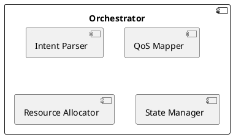

# MBSE Models - O-RAN Intent-Based MANO

## Model-Based Systems Engineering (MBSE) Artifacts

This directory contains all system models following MBSE principles for the O-RAN Intent-Based MANO project.

## Directory Structure

```
models/
├── system/          # System-level models (context, requirements)
├── component/       # Component-level models (architecture, interfaces)
├── data/           # Data models (schemas, state machines)
└── deployment/     # Deployment models (infrastructure, configuration)
```

## Model Types

### 1. System Models (`system/`)
- **System Context Diagram**: External interfaces and actors
- **Requirements Model**: Functional and non-functional requirements
- **Use Case Diagrams**: User interactions and scenarios
- **Sequence Diagrams**: Cross-component interactions

### 2. Component Models (`component/`)
- **Component Diagrams**: Internal architecture (Orchestrator, VNF Operator, TN Manager, etc.)
- **Class Diagrams**: Object-oriented design
- **Interface Contracts**: API specifications and protocols
- **State Machine Diagrams**: Component lifecycle and states

### 3. Data Models (`data/`)
- **QoS Schema Models**: Intent → QoS transformation models
- **Resource Models**: Kubernetes CRD definitions
- **State Models**: System and slice state transitions
- **Data Flow Diagrams**: Information flow between components

### 4. Deployment Models (`deployment/`)
- **Infrastructure Models**: Kubernetes cluster topology
- **Network Models**: RAN, TN, CN deployment architecture
- **Configuration Models**: GitOps package structures
- **Multi-site Models**: Regional/edge distribution

## Modeling Guidelines

### Model Creation Workflow
1. **Requirements First**: Start with requirements traceability matrix
2. **Context Before Detail**: System context → component → implementation
3. **Validation**: Validate models against requirements
4. **Synchronization**: Keep models updated with code changes

### Model Formats
- **Primary**: PlantUML (`.puml`) - version-controllable text-based diagrams
- **Alternative**: Draw.io (`.drawio`) - for complex visual models
- **Export**: SVG/PNG for documentation

### Traceability
Each model must link to:
- Requirements (in `docs/specifications/`)
- Implementation (source code references)
- Tests (test case IDs)
- Documentation (architecture docs)

## Model Review Process

### Before Implementation
1. ✅ Model reviewed by architect
2. ✅ Validated against requirements
3. ✅ Test scenarios derived from model
4. ✅ Model checked into version control

### After Implementation
1. ✅ Code matches model design
2. ✅ Tests verify model behavior
3. ✅ Model updated if design evolved
4. ✅ Traceability links maintained

## Tools

### Recommended Modeling Tools
- **PlantUML**: Text-based UML diagrams (preferred)
- **Draw.io**: Visual diagram editor
- **Mermaid**: Markdown-embedded diagrams
- **SysML**: For complex system engineering models

### Installation
```bash
# PlantUML (requires Java)
sudo apt-get install -y plantuml

# Generate diagrams from .puml files
plantuml models/**/*.puml

# VSCode extension
code --install-extension jebbs.plantuml
```

## Example: TDD + MBSE Workflow

### Step 1: Create Component Model


### Step 2: Define Interface Contract
```yaml
# component/orchestrator-api.yaml
IntentAPI:
  POST /intents:
    request: IntentSpec
    response: IntentStatus
    errors: [ValidationError, ResourceError]
```

### Step 3: Write Tests (TDD)
```go
// orchestrator/pkg/intent/parser_test.go
func TestParseIntent(t *testing.T) {
    // RED: Test fails (parser not implemented)
    tests := []struct{
        name string
        input IntentSpec
        want QoSProfile
    }{
        // Test cases from model
    }
}
```

### Step 4: Implement to Pass Tests
```go
// orchestrator/pkg/intent/parser.go
func ParseIntent(spec IntentSpec) (QoSProfile, error) {
    // GREEN: Minimal implementation to pass test
}
```

### Step 5: Update Model with Implementation Details
- Document actual implementation decisions
- Update sequence diagrams with real call flows
- Add notes on deviations from original design

## Current Models Status

| Model Type | Status | Last Updated | Reviewer |
|------------|--------|--------------|----------|
| System Context | 🟡 Draft | 2025-09-26 | - |
| Component Architecture | 🟡 Draft | 2025-09-26 | - |
| QoS Data Model | 🟢 Complete | 2025-09-26 | - |
| Deployment Model | 🟡 Draft | 2025-09-26 | - |

**Status Legend**:
- 🔴 Not Started
- 🟡 Draft / In Progress
- 🟢 Complete
- ✅ Validated & Implemented

## Next Steps

### Priority Models to Create
1. **System Context Diagram**: Define all external interfaces
2. **Intent Processing Sequence**: End-to-end flow from intent to deployment
3. **State Machine Models**: Slice lifecycle, VNF lifecycle
4. **Network Topology Models**: RAN/TN/CN interconnection

### Model-Driven Code Generation
Future enhancement: Generate code skeletons from models
- API interfaces from component models
- State machines from state diagrams
- Data structures from data models

---

**Note**: All models must be reviewed and validated before implementation begins. Follow TDD principles: test scenarios are derived from models before coding starts.