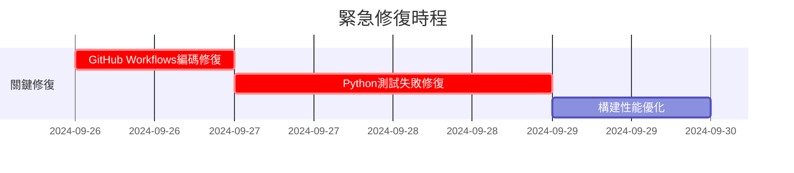
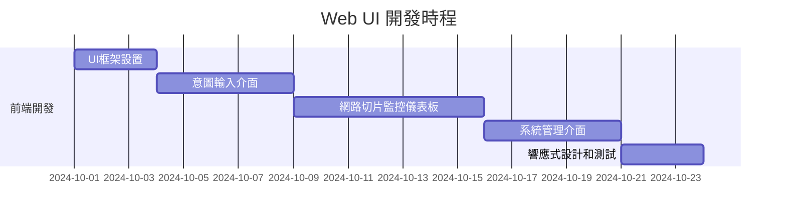
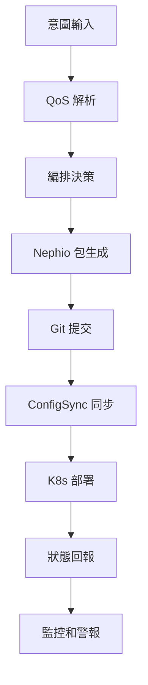
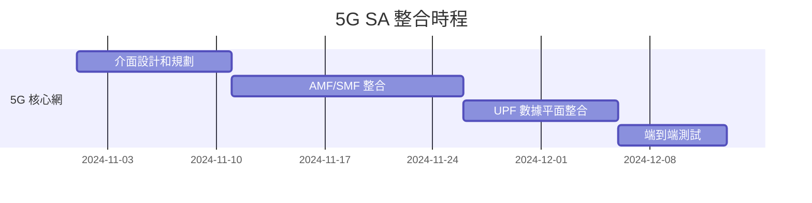
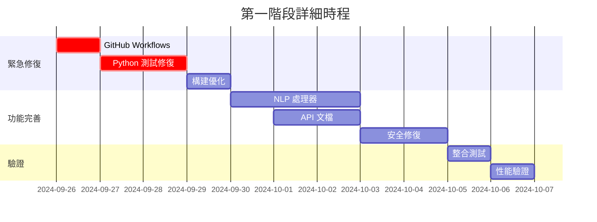
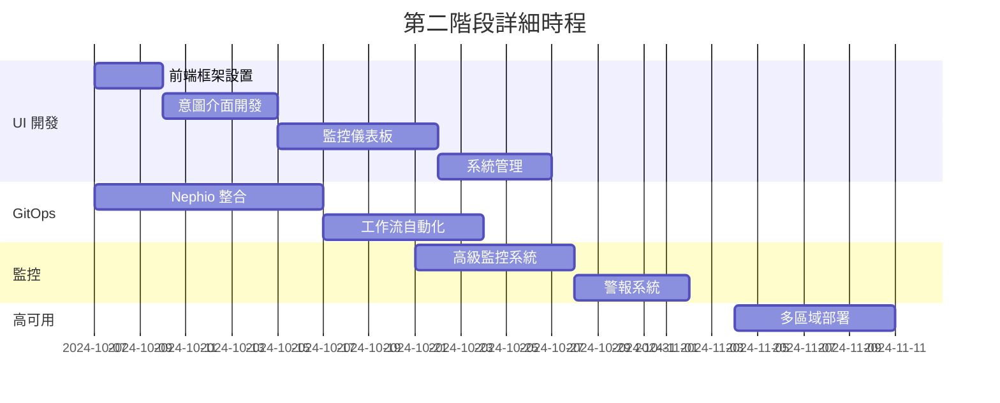
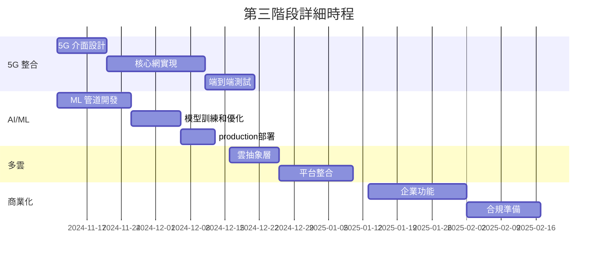
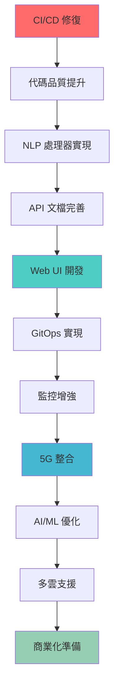
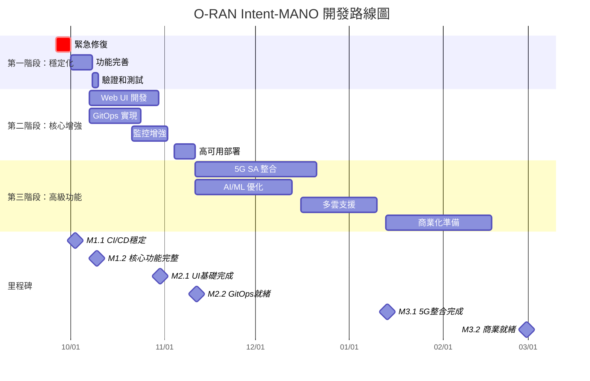

# O-RAN Intent-MANO 開發路線圖 (Development Roadmap)

## 執行摘要 (Executive Summary)

**專案：** O-RAN Intent-Based MANO for Network Slicing
**版本：** v2.0.0 規劃路線圖
**日期：** 2024年9月 - 2025年6月
**總預算：** 估計 24-32 人月工作量

### 核心目標
基於現有的 58 秒端到端部署成就，將 O-RAN Intent-MANO 系統從原型階段推進到生產就緒狀態，實現商業化部署能力。

---

## 🎯 發展階段概覽

### 第一階段：穩定化 (1-2 週)
**目標：** 修復所有關鍵 CI/CD 問題，確保系統基礎穩定

### 第二階段：核心增強 (1-2 個月)
**目標：** 開發核心功能，提升用戶體驗和系統可靠性

### 第三階段：高級功能 (3-6 個月)
**目標：** 實現高級特性，準備商業化部署

---

## 📊 現狀分析

### 技術債務評估
基於 CI 模擬報告的分析結果：

| 類別 | 狀態 | 影響 | 優先級 |
|------|------|------|--------|
| **GitHub Workflows 編碼問題** | ❌ 關鍵 | 阻止所有 CI 執行 | 🚨 緊急 |
| **Python 測試失敗** | ❌ 高風險 | 19% 失敗率 | 🔴 高 |
| **構建性能問題** | ⚠️ 中等 | 超時風險 | 🟡 中 |
| **Go 模組編譯** | ✅ 正常 | 無影響 | 🟢 低 |
| **Docker 配置** | ✅ 良好 | 輕微警告 | 🟢 低 |

### 功能完整度分析
- **已實現功能：** 60% (核心框架、基礎編排)
- **缺失核心功能：** 25% (UI 儀表板、完整 GitOps)
- **高級功能：** 15% (AI/ML 優化、多雲支援)

---

## 🚀 第一階段：穩定化 (Week 1-2)

### 🚨 緊急修復 (3-5 天)

#### 1.1 CI/CD 關鍵問題修復
**負責人：** DevOps 工程師
**工時估算：** 16-24 小時

**交付物：**
- [ ] 修復所有 GitHub Workflows UTF-8 編碼問題
- [ ] 解決 11 個 Python 測試失敗 + 4 個錯誤
- [ ] 優化 Makefile 構建性能，減少超時
- [ ] 完成 kubectl 驗證設置

**成功標準：**
- CI 管道 100% 可執行
- Python 測試通過率 ≥ 95%
- 構建時間 < 5 分鐘

#### 1.2 代碼質量提升
**負責人：** 代碼審查團隊
**工時估算：** 8-12 小時

**交付物：**
- [ ] 修復所有 TODO 項目中的關鍵實現缺失
- [ ] 完善錯誤處理機制
- [ ] 添加缺失的單元測試

### 🔧 核心功能完善 (5-10 天)

#### 1.3 NLP 處理器完整實現
**負責人：** AI/ML 開發工程師
**工時估算：** 24-32 小時

**交付物：**
- [ ] 實現完整的 NLPProcessor 類別
- [ ] 修復意圖分類邏輯 (Gaming, Voice calls → URLLC)
- [ ] 添加置信度評分邊界條件處理
- [ ] 實現缺失的可靠性字段

#### 1.4 API 文檔完善
**負責人：** 技術寫作工程師
**工時估算：** 16-20 小時

**交付物：**
- [ ] 完整的 OpenAPI 3.0 規範
- [ ] 互動式 API 文檔 (Swagger UI)
- [ ] API 使用範例和最佳實踐
- [ ] 錯誤代碼完整文檔

#### 1.5 安全問題修復
**負責人：** 安全工程師
**工時估算：** 12-16 小時

**交付物：**
- [ ] 修復已知的安全漏洞
- [ ] 實現 RBAC 完整配置
- [ ] 加強網路政策和微分段
- [ ] 完成安全掃描整合

---

## 🏗️ 第二階段：核心增強 (Month 1-2)

### 2.1 Web UI 儀表板開發 (3-4 週)

#### 前端開發
**負責人：** 前端開發團隊
**工時估算：** 120-160 小時

**功能規格：**
- **意圖輸入介面**
  - 自然語言輸入框
  - 即時語法驗證
  - QoS 參數預覽
  - 歷史意圖查詢

- **監控儀表板**
  - 實時網路切片狀態
  - 性能指標圖表
  - 警報和通知
  - 拓撲視覺化

- **系統管理**
  - 用戶管理和 RBAC
  - 配置管理
  - 系統健康監控
  - 審計日誌

**技術棧：**
- React 18 + TypeScript
- Material-UI 或 Ant Design
- D3.js 用於數據視覺化
- WebSocket 用於實時更新

#### 後端 API 增強
**負責人：** 後端開發團隊
**工時估算：** 80-100 小時

**交付物：**
- [ ] RESTful API 完整實現
- [ ] GraphQL 查詢介面 (可選)
- [ ] WebSocket 實時通知
- [ ] 用戶認證和授權
- [ ] 速率限制和快取機制

### 2.2 完整 GitOps 流程實現 (2-3 週)

#### Nephio 整合優化
**負責人：** 平台工程師
**工時估算：** 60-80 小時

**交付物：**
- [ ] 完整的 Nephio 包生成器
- [ ] 自動化 ConfigSync 配置
- [ ] 多集群部署支援
- [ ] 回滾和版本管理

#### GitOps 工作流
**負責人：** DevOps 工程師
**工時估算：** 40-60 小時

**流程設計：**

### 2.3 監控和可觀測性增強 (2 週)

#### 進階監控系統
**負責人：** SRE 工程師
**工時估算：** 60-80 小時

**交付物：**
- [ ] 自定義 Prometheus 指標
- [ ] Grafana 儀表板模板
- [ ] 分散式追蹤 (Jaeger)
- [ ] 日誌聚合 (ELK Stack)
- [ ] SLA/SLO 監控

#### 警報和事件響應
**負責人：** 運維團隊
**工時估算：** 24-32 小時

**交付物：**
- [ ] 多級別警報規則
- [ ] 自動事件響應
- [ ] PagerDuty/Slack 整合
- [ ] 運維手冊和指南

### 2.4 高可用性部署 (1-2 週)

#### 多區域部署
**負責人：** 基礎設施工程師
**工時估算：** 40-60 小時

**交付物：**
- [ ] 多區域 Kubernetes 集群
- [ ] 跨區域網路配置
- [ ] 數據複製和備份
- [ ] 災難恢復程序

---

## 🌟 第三階段：高級功能 (Month 3-6)

### 3.1 5G SA 核心網整合 (6-8 週)

#### 5G 核心網介面
**負責人：** 5G 專家團隊
**工時估算：** 200-280 小時

**技術規格：**
- **支援的網路功能**
  - AMF (Access and Mobility Management Function)
  - SMF (Session Management Function)
  - UPF (User Plane Function)
  - PCF (Policy Control Function)
  - UDM (Unified Data Management)

- **標準合規性**
  - 3GPP Release 16/17 支援
  - O-RAN O1/O2 介面
  - ETSI NFV MANO 合規

**實現里程碑：**

### 3.2 AI/ML 驅動的資源優化 (4-6 週)

#### 機器學習管道
**負責人：** ML 工程師
**工時估算：** 150-200 小時

**功能實現：**
- **預測性資源調度**
  - 歷史使用模式分析
  - 需求預測模型
  - 動態資源分配

- **智能意圖理解**
  - NLP 模型優化
  - 上下文理解增強
  - 多語言支援

- **性能優化引擎**
  - 實時性能監控
  - 自動調優建議
  - 成本效益分析

**ML 技術棧：**
- TensorFlow/PyTorch 用於深度學習
- Scikit-learn 用於傳統 ML
- MLflow 用於模型管理
- Kubeflow 用於 ML 管道

### 3.3 多雲支援 (3-4 週)

#### 雲平台抽象化
**負責人：** 雲架構師
**工時估算：** 100-140 小時

**支援的雲平台：**
- Amazon Web Services (EKS)
- Microsoft Azure (AKS)
- Google Cloud Platform (GKE)
- 私有雲 (OpenStack)

**交付物：**
- [ ] 雲平台抽象層
- [ ] 統一資源管理
- [ ] 跨雲網路連接
- [ ] 數據同步機制

### 3.4 商業化準備 (6-8 週)

#### 企業級功能
**負責人：** 產品經理 + 開發團隊
**工時估算：** 180-240 小時

**功能清單：**
- **多租戶支援**
  - 租戶隔離
  - 資源配額管理
  - 計費和使用追蹤

- **合規性和認證**
  - SOC 2 合規性
  - ISO 27001 認證準備
  - GDPR 數據保護

- **企業整合**
  - LDAP/AD 整合
  - SSO 支援
  - 企業 API 閘道

- **商業智能**
  - 使用分析
  - 成本優化建議
  - 業務指標儀表板

---

## 📋 每個階段的交付物

### 第一階段交付物 (穩定化)

#### 技術交付物
1. **修復報告**
   - CI/CD 修復摘要
   - 測試通過率報告
   - 性能改進指標

2. **代碼品質報告**
   - 代碼覆蓋率報告
   - 靜態分析結果
   - 安全掃描報告

3. **API 文檔**
   - OpenAPI 規範檔案
   - 互動式文檔網站
   - 使用者指南

#### 流程交付物
1. **開發流程文檔**
   - 代碼審查標準
   - 測試策略
   - 部署程序

2. **運維手冊**
   - 監控指南
   - 故障排除手冊
   - 備份恢復程序

### 第二階段交付物 (核心增強)

#### 功能交付物
1. **Web UI 應用程式**
   - 完整的前端應用
   - 用戶手冊
   - 管理員指南

2. **GitOps 平台**
   - 自動化工作流
   - 配置管理工具
   - 部署範本

3. **監控平台**
   - Grafana 儀表板
   - 警報規則配置
   - SLO/SLA 定義

#### 文檔交付物
1. **系統架構文檔**
   - 詳細設計文檔
   - 整合指南
   - 最佳實踐

2. **用戶文檔**
   - 快速入門指南
   - 使用者手冊
   - 常見問題解答

### 第三階段交付物 (高級功能)

#### 技術交付物
1. **5G SA 整合模組**
   - 核心網介面實現
   - 測試套件
   - 認證報告

2. **AI/ML 引擎**
   - 訓練好的模型
   - 推理服務
   - 性能基準

3. **多雲部署套件**
   - 雲平台範本
   - 遷移工具
   - 最佳實踐指南

#### 商業交付物
1. **商業化套件**
   - 產品規格書
   - 定價模型
   - 銷售材料

2. **合規文檔**
   - 安全認證
   - 合規檢查表
   - 法律文檔

---

## 💰 資源和時間估算

### 人力資源配置

#### 核心開發團隊 (全職)
| 角色 | 人數 | 第一階段 | 第二階段 | 第三階段 |
|------|------|----------|----------|----------|
| **專案經理** | 1 | ✅ | ✅ | ✅ |
| **技術主管** | 1 | ✅ | ✅ | ✅ |
| **Go 後端工程師** | 2 | ✅ | ✅ | ✅ |
| **Python/AI 工程師** | 1 | ✅ | ✅ | ✅ |
| **前端工程師** | 1 | - | ✅ | ✅ |
| **DevOps 工程師** | 1 | ✅ | ✅ | ✅ |
| **5G 專家** | 1 | - | - | ✅ |
| **ML 工程師** | 1 | - | - | ✅ |

#### 專家顧問 (兼職)
| 角色 | 參與度 | 主要階段 |
|------|--------|----------|
| **雲架構師** | 20% | 第二、三階段 |
| **安全專家** | 15% | 全階段 |
| **技術寫作師** | 30% | 全階段 |
| **QA 工程師** | 50% | 第二、三階段 |

### 時間估算詳細分解

#### 第一階段 (1-2 週)

**總工時：** 約 200-280 小時 (25-35 人日)

#### 第二階段 (1-2 個月)

**總工時：** 約 800-1000 小時 (100-125 人日)

#### 第三階段 (3-6 個月)

**總工時：** 約 1500-2000 小時 (187-250 人日)

### 成本估算

#### 人力成本 (假設平均日薪 $500 USD)
- **第一階段：** $12,500 - $17,500 USD
- **第二階段：** $50,000 - $62,500 USD
- **第三階段：** $93,500 - $125,000 USD
- **總計：** $156,000 - $205,000 USD

#### 基礎設施成本
- **開發環境：** $2,000/月
- **測試環境：** $3,000/月
- **生產環境：** $5,000/月
- **雲服務和工具：** $1,000/月
- **6個月總計：** $66,000 USD

#### 其他成本
- **軟體授權：** $10,000 USD
- **培訓和認證：** $15,000 USD
- **第三方服務：** $8,000 USD
- **總計：** $33,000 USD

**項目總成本估算：** $255,000 - $304,000 USD

---

## 🎯 依賴關係和風險

### 關鍵依賴關係

### 風險評估矩陣

| 風險類別 | 機率 | 影響 | 緩解策略 |
|----------|------|------|----------|
| **技術債務累積** | 高 | 高 | 持續重構，代碼審查 |
| **5G 標準變更** | 中 | 高 | 密切關注標準，模組化設計 |
| **人員流失** | 中 | 高 | 知識文檔化，交叉培訓 |
| **第三方依賴問題** | 中 | 中 | 多供應商策略，備用方案 |
| **性能不達標** | 低 | 高 | 早期性能測試，基準設定 |
| **安全漏洞** | 低 | 高 | 安全審計，滲透測試 |

### 緩解策略

#### 技術風險緩解
1. **架構風險**
   - 採用微服務架構，降低耦合
   - 實施自動化測試，確保品質
   - 建立性能基準和監控

2. **整合風險**
   - 早期原型驗證
   - 階段性整合測試
   - 備用技術方案

#### 項目風險緩解
1. **時程風險**
   - 緩衝時間 (20% buffer)
   - 每週進度檢查
   - 里程碑調整機制

2. **資源風險**
   - 關鍵人員備援
   - 外部專家支援
   - 技能培訓計畫

---

## 📈 里程碑和追蹤機制

### 關鍵里程碑

#### 第一階段里程碑
1. **M1.1：CI/CD 穩定** (Week 1)
   - 所有 GitHub Actions 正常運行
   - Python 測試通過率 ≥ 95%
   - 構建時間 < 5 分鐘

2. **M1.2：核心功能完整** (Week 2)
   - NLP 處理器完全實現
   - API 文檔 100% 完成
   - 安全問題全部修復

#### 第二階段里程碑
1. **M2.1：UI 基礎完成** (Month 1.5)
   - 基本 Web UI 可用
   - 意圖輸入功能正常
   - 基礎監控儀表板

2. **M2.2：GitOps 就緒** (Month 2)
   - 完整 GitOps 工作流
   - 自動化部署管道
   - 高可用性配置

#### 第三階段里程碑
1. **M3.1：5G 整合完成** (Month 4)
   - 5G SA 核心網整合
   - 端到端測試通過
   - 標準合規驗證

2. **M3.2：商業就緒** (Month 6)
   - 所有企業級功能
   - 合規認證完成
   - 商業化文檔齊全

### 追蹤和監控機制

#### 進度追蹤工具
1. **項目管理工具**
   - Jira 用於任務追蹤
   - Confluence 用於文檔管理
   - GitHub Projects 用於代碼相關任務

2. **指標儀表板**
   - 開發速度指標
   - 代碼品質指標
   - 測試覆蓋率
   - 性能基準

#### 報告機制
1. **每週狀態報告**
   - 進度更新
   - 風險評估
   - 阻礙問題

2. **月度審查會議**
   - 里程碑檢查
   - 資源調整
   - 策略修正

3. **季度業務審查**
   - 商業價值評估
   - 市場對準
   - 投資決策

### 成功標準

#### 技術成功標準
1. **性能指標**
   - 端到端部署時間 < 60 秒
   - 系統可用性 > 99.9%
   - API 響應時間 < 200ms

2. **品質指標**
   - 代碼覆蓋率 > 85%
   - 安全掃描 0 關鍵問題
   - 用戶滿意度 > 4.5/5

#### 商業成功標準
1. **市場就緒度**
   - 至少 3 個 POC 客戶
   - 技術合作夥伴簽約
   - 商業模式驗證

2. **財務指標**
   - 開發成本控制在預算內
   - 首年收入目標達成
   - 投資回報率 > 150%

---

## 🔄 持續改進和學習

### 敏捷開發實踐
1. **Scrum 框架**
   - 2週 Sprint 週期
   - 每日站會
   - Sprint 回顧和規劃

2. **DevOps 實踐**
   - 持續整合/持續部署
   - 基礎設施即代碼
   - 監控和日誌

### 知識管理
1. **技術文檔**
   - 架構決策記錄 (ADR)
   - 最佳實踐文檔
   - 故障排除指南

2. **培訓計畫**
   - 新人入職培訓
   - 技術技能提升
   - 跨功能知識分享

### 社區參與
1. **開源貢獻**
   - 回饋上游項目
   - 分享最佳實踐
   - 技術演講和文章

2. **標準化參與**
   - O-RAN 聯盟活動
   - 3GPP 標準追蹤
   - 業界會議參與

---

## 📊 附錄：詳細甘特圖

### 完整項目甘特圖

---

## 🎯 結論和下一步行動

### 執行摘要
本開發路線圖為 O-RAN Intent-MANO 項目提供了一個清晰、可執行的發展路徑。通過三個階段的系統性開發，我們將：

1. **第一階段**：在 1-2 週內解決所有關鍵技術債務，建立穩定的開發基礎
2. **第二階段**：在 1-2 個月內開發核心企業級功能，顯著提升用戶體驗
3. **第三階段**：在 3-6 個月內實現高級功能，準備商業化部署

### 立即行動項目
**本週內必須啟動：**
1. ✅ 組建核心開發團隊
2. ✅ 設置項目管理工具和流程
3. ✅ 開始 GitHub Workflows 編碼問題修復
4. ✅ 建立每週狀態報告機制

### 成功關鍵因素
1. **強力的項目管理**：確保里程碑按時達成
2. **高品質的代碼實踐**：維持長期可維護性
3. **積極的風險管理**：提前識別和緩解風險
4. **持續的利害關係人溝通**：確保期望對齊

### 預期成果
成功執行此路線圖將使 O-RAN Intent-MANO 成為：
- **業界領先**的意圖驅動網路切片解決方案
- **生產就緒**的企業級平台
- **標準合規**的 O-RAN 實現
- **商業可行**的產品

**項目成功將為組織帶來：**
- 技術領導地位
- 新的收入來源
- 強化的技術能力
- 擴大的市場機會

---

*最後更新：2024年9月26日*
*版本：v1.0*
*批准者：項目指導委員會*