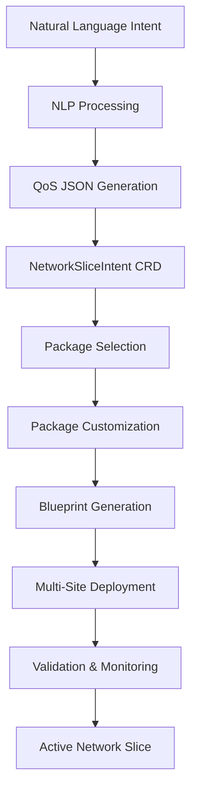

# GitOps Workflow Specifications for O-RAN Intent-Based MANO with Nephio R5+

## Executive Summary

This specification defines comprehensive GitOps workflows for the Nephio R5+ integrated O-RAN Intent-Based MANO system, enabling automated intent-to-deployment pipelines with <10 minute E2E target times.

## 1. GitOps Repository Architecture

### 1.1 Multi-Repository Structure

```
O-RAN-MANO-GitOps/
├── catalog-repo/                    # Package templates and functions
│   ├── packages/
│   │   ├── ran-functions/
│   │   ├── core-network/
│   │   └── transport-network/
│   └── functions/
├── blueprint-repo/                  # Customized packages
│   ├── network-slices/
│   │   ├── embb/
│   │   ├── urllc/
│   │   └── miot/
│   └── site-configs/
└── deployment-repos/               # Cluster-specific deployments
    ├── edge-clusters/
    ├── regional-clusters/
    └── central-clusters/
```

### 1.2 Branch Strategy

```yaml
# Repository Branch Model
branches:
  main:
    protection: true
    required_reviews: 2
    auto_merge: false
  develop:
    from: main
    auto_promotion: true
  staging:
    from: develop
    validation_gates: ["security", "performance", "compliance"]
  production:
    from: staging
    approval_required: true
    rollback_enabled: true
```

## 2. Intent-to-Deployment Pipeline

### 2.1 Workflow Overview



### 2.2 Pipeline Configuration

```yaml
# .github/workflows/intent-deployment.yml
name: Intent-to-Deployment Pipeline
on:
  push:
    paths: ['intents/**/*.yaml']
  workflow_dispatch:
    inputs:
      intent_file:
        description: 'Intent file path'
        required: true

jobs:
  intent-processing:
    runs-on: ubuntu-latest
    steps:
      - name: Process Natural Language Intent
        uses: ./.github/actions/nlp-processor
        with:
          intent_file: ${{ github.event.inputs.intent_file }}

      - name: Generate QoS Parameters
        uses: ./.github/actions/qos-generator
        with:
          nlp_output: ${{ steps.process.outputs.qos_json }}

      - name: Create NetworkSliceIntent
        uses: ./.github/actions/crd-generator
        with:
          qos_params: ${{ steps.qos.outputs.parameters }}

  package-generation:
    needs: intent-processing
    runs-on: ubuntu-latest
    steps:
      - name: Select Package Templates
        uses: ./.github/actions/package-selector
        with:
          slice_type: ${{ needs.intent-processing.outputs.slice_type }}
          qos_requirements: ${{ needs.intent-processing.outputs.qos }}

      - name: Customize Packages
        uses: ./.github/actions/package-customizer
        with:
          templates: ${{ steps.select.outputs.templates }}
          site_configs: ${{ needs.intent-processing.outputs.sites }}

      - name: Generate Blueprints
        uses: ./.github/actions/blueprint-generator
        with:
          customized_packages: ${{ steps.customize.outputs.packages }}

  deployment-orchestration:
    needs: package-generation
    runs-on: ubuntu-latest
    strategy:
      matrix:
        cluster: [edge01, edge02, regional01, central01]
    steps:
      - name: Deploy to Cluster
        uses: ./.github/actions/cluster-deployer
        with:
          cluster: ${{ matrix.cluster }}
          blueprint: ${{ needs.package-generation.outputs.blueprint }}

      - name: Validate Deployment
        uses: ./.github/actions/deployment-validator
        with:
          cluster: ${{ matrix.cluster }}
          expected_qos: ${{ needs.intent-processing.outputs.qos }}

      - name: Monitor Performance
        uses: ./.github/actions/performance-monitor
        with:
          cluster: ${{ matrix.cluster }}
          metrics: ["throughput", "latency", "reliability"]
```

## 3. Multi-Cluster Deployment Coordination

### 3.1 Hierarchical Deployment Strategy

```yaml
# Multi-cluster deployment coordination
apiVersion: v1
kind: ConfigMap
metadata:
  name: deployment-strategy
data:
  strategy.yaml: |
    phases:
      - name: infrastructure
        clusters: [central01]
        components: [porch, config-sync, monitoring]
        timeout: 120s

      - name: core-network
        clusters: [regional01]
        components: [amf, smf, nrf, udm]
        dependencies: [infrastructure]
        timeout: 180s

      - name: user-plane
        clusters: [edge01, edge02]
        components: [upf, tn-agent]
        dependencies: [core-network]
        timeout: 150s

      - name: ran-functions
        clusters: [edge01, edge02]
        components: [du, cu-cp, cu-up]
        dependencies: [user-plane]
        timeout: 200s

    rollback:
      trigger_conditions:
        - deployment_failure
        - qos_violation
        - health_check_failure
      strategy: reverse_order
      timeout: 300s
```

### 3.2 Site-Specific Customizations

```yaml
# Edge cluster customization overlay
apiVersion: kustomize.config.k8s.io/v1beta1
kind: Kustomization
metadata:
  name: edge01-overlay

resources:
  - ../../base/upf
  - ../../base/tn-agent

patchesStrategicMerge:
  - upf-edge-config.yaml
  - resource-limits.yaml

configMapGenerator:
  - name: site-config
    literals:
      - SITE_ID=edge01
      - LOCATION=tokyo
      - QOS_PROFILE=urllc
      - MAX_SESSIONS=10000

images:
  - name: upf
    newTag: v2.1.0-edge-optimized
```

## 4. CI/CD Quality Gates

### 4.1 Validation Pipeline

```yaml
# Package validation workflow
name: Package Validation
on:
  pull_request:
    paths: ['packages/**']

jobs:
  security-scan:
    runs-on: ubuntu-latest
    steps:
      - name: Container Security Scan
        uses: aquasec/trivy-action@master
        with:
          scan-type: 'fs'
          scan-ref: 'packages/'

  performance-test:
    runs-on: ubuntu-latest
    steps:
      - name: Load Test
        run: |
          kubectl apply -f test/load-test.yaml
          kubectl wait --for=condition=complete job/load-test --timeout=600s

  compliance-check:
    runs-on: ubuntu-latest
    steps:
      - name: O-RAN Compliance Validation
        uses: ./.github/actions/oran-validator
        with:
          package_path: packages/
          standards: ["O2", "A1", "E2"]
```

### 4.2 Automated Promotion

```yaml
# Promotion workflow between environments
name: Environment Promotion
on:
  workflow_run:
    workflows: ["Package Validation"]
    types: [completed]
    branches: [develop]

jobs:
  promote-to-staging:
    if: ${{ github.event.workflow_run.conclusion == 'success' }}
    runs-on: ubuntu-latest
    steps:
      - name: Create Staging PR
        uses: peter-evans/create-pull-request@v4
        with:
          token: ${{ secrets.GITHUB_TOKEN }}
          title: "Auto-promote to staging"
          body: "Automated promotion from develop"
          base: staging
          branch: auto-promote-staging
```

## 5. Configuration Management

### 5.1 Environment-Specific Configs

```yaml
# Environment configuration matrix
environments:
  development:
    clusters: [dev-edge01]
    replicas: 1
    resources:
      cpu: 100m
      memory: 128Mi
    monitoring: basic

  staging:
    clusters: [staging-edge01, staging-regional01]
    replicas: 2
    resources:
      cpu: 500m
      memory: 512Mi
    monitoring: enhanced

  production:
    clusters: [edge01, edge02, regional01, central01]
    replicas: 3
    resources:
      cpu: 1000m
      memory: 1Gi
    monitoring: full
    backup: enabled
    disaster_recovery: enabled
```

### 5.2 Secret Management

```yaml
# Sealed Secrets for GitOps
apiVersion: bitnami.com/v1alpha1
kind: SealedSecret
metadata:
  name: nephio-credentials
  namespace: nephio-system
spec:
  encryptedData:
    PORCH_API_TOKEN: AgBy3i4OJSWK+PiTySYZZA9rO43cGDEQAx...
    GIT_ACCESS_TOKEN: AgAh8d7KJHGF+MnBvCxWZB8qP21dFGHJBx...
    O2IMS_API_KEY: AgCx9k2LKHDE+QrTzSXYA8sN32eFHIJCy...
```

## 6. Monitoring and Observability

### 6.1 Deployment Tracking

```yaml
# GitOps monitoring configuration
apiVersion: v1
kind: ConfigMap
metadata:
  name: gitops-monitoring
data:
  prometheus.yml: |
    global:
      scrape_interval: 15s

    scrape_configs:
      - job_name: 'gitops-controller'
        kubernetes_sd_configs:
          - role: pod
        relabel_configs:
          - source_labels: [__meta_kubernetes_pod_label_app]
            action: keep
            regex: config-sync|porch

      - job_name: 'deployment-status'
        static_configs:
          - targets: ['nephio-controller:8080']

    rule_files:
      - "deployment-alerts.yml"

  deployment-alerts.yml: |
    groups:
      - name: gitops.alerts
        rules:
          - alert: DeploymentFailed
            expr: gitops_deployment_status{status="failed"} > 0
            for: 5m
            annotations:
              summary: "GitOps deployment failed"

          - alert: QoSViolation
            expr: network_slice_qos_violation > 0
            for: 2m
            annotations:
              summary: "Network slice QoS violation detected"
```

### 6.2 Performance Dashboards

```yaml
# Grafana dashboard for GitOps workflows
apiVersion: v1
kind: ConfigMap
metadata:
  name: gitops-dashboard
data:
  dashboard.json: |
    {
      "dashboard": {
        "title": "O-RAN MANO GitOps Workflow",
        "panels": [
          {
            "title": "Deployment Timeline",
            "type": "graph",
            "targets": [
              {
                "expr": "deployment_duration_seconds",
                "legendFormat": "{{cluster}}-{{component}}"
              }
            ]
          },
          {
            "title": "QoS Metrics",
            "type": "stat",
            "targets": [
              {
                "expr": "network_slice_throughput_mbps",
                "legendFormat": "Throughput"
              },
              {
                "expr": "network_slice_latency_ms",
                "legendFormat": "Latency"
              }
            ]
          }
        ]
      }
    }
```

## 7. Rollback and Recovery Workflows

### 7.1 Automated Rollback

```yaml
# Rollback workflow trigger
name: Automated Rollback
on:
  repository_dispatch:
    types: [qos-violation, deployment-failure]

jobs:
  rollback:
    runs-on: ubuntu-latest
    steps:
      - name: Identify Last Known Good State
        run: |
          LAST_GOOD=$(git log --format="%H" --grep="deployment-success" -n 1)
          echo "ROLLBACK_COMMIT=$LAST_GOOD" >> $GITHUB_ENV

      - name: Create Rollback Branch
        run: |
          git checkout -b rollback-$(date +%s) $ROLLBACK_COMMIT
          git push origin rollback-$(date +%s)

      - name: Execute Multi-Cluster Rollback
        uses: ./.github/actions/cluster-rollback
        with:
          target_commit: ${{ env.ROLLBACK_COMMIT }}
          clusters: "edge01,edge02,regional01"

      - name: Validate Rollback Success
        uses: ./.github/actions/rollback-validator
        with:
          expected_state: ${{ env.ROLLBACK_COMMIT }}
```

## 8. Performance Optimization

### 8.1 Pipeline Acceleration

```yaml
# Performance-optimized workflow
name: Fast Deploy Pipeline
on:
  push:
    paths: ['urgent-deploy/**']

jobs:
  fast-deploy:
    runs-on: ubuntu-latest
    steps:
      - name: Parallel Package Generation
        run: |
          # Generate packages in parallel
          for slice_type in embb urllc miot; do
            generate-package $slice_type &
          done
          wait

      - name: Concurrent Cluster Deployment
        run: |
          # Deploy to all clusters simultaneously
          for cluster in edge01 edge02 regional01; do
            deploy-to-cluster $cluster &
          done
          wait

      - name: Fast Validation
        run: |
          # Quick health checks only
          validate-deployment --mode=fast --timeout=60s
```

## 9. Integration Points

### 9.1 Porch Integration

```yaml
# Porch workflow integration
apiVersion: v1
kind: ConfigMap
metadata:
  name: porch-gitops-integration
data:
  workflow.yaml: |
    triggers:
      - event: package.proposed
        action: create_pr
        target_repo: blueprint-repo

      - event: package.published
        action: deploy
        target_clusters: [edge01, edge02]

      - event: package.deprecated
        action: schedule_removal
        grace_period: 30d
```

### 9.2 O2 Interface Integration

```yaml
# O2ims/O2dms webhook integration
apiVersion: apps/v1
kind: Deployment
metadata:
  name: o2-webhook-handler
spec:
  template:
    spec:
      containers:
      - name: webhook
        env:
        - name: GITHUB_WEBHOOK_SECRET
          valueFrom:
            secretKeyRef:
              name: github-webhook
              key: secret
        - name: O2IMS_ENDPOINT
          value: "https://o2ims.operator.com/api/v1"
```

## 10. Implementation Timeline

```yaml
# 16-week implementation roadmap
phases:
  phase1: # Weeks 1-4: Foundation
    - setup_repositories
    - configure_basic_workflows
    - implement_security_policies

  phase2: # Weeks 5-8: Integration
    - porch_integration
    - configsync_setup
    - monitoring_deployment

  phase3: # Weeks 9-12: Automation
    - intent_processing_pipeline
    - multi_cluster_orchestration
    - performance_optimization

  phase4: # Weeks 13-16: Production
    - security_hardening
    - disaster_recovery
    - performance_tuning
    - documentation_completion
```

This specification provides a complete GitOps workflow foundation for the O-RAN Intent-Based MANO system, enabling automated, reliable, and fast network slice deployments through comprehensive automation and orchestration.