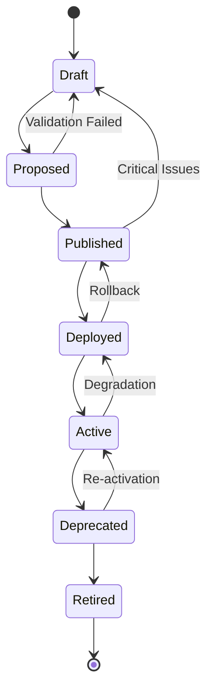

# Package Lifecycle Management Specification
## Nephio R5+ Integrated O-RAN Intent-Based MANO System

### Version: 1.0.0
### Date: 2025-09-23
### Status: Draft

---

## 1. Executive Summary

This specification defines comprehensive package lifecycle management for the Nephio R5+ integrated O-RAN Intent-Based MANO system. The package lifecycle management system enables automated deployment, management, and optimization of O-RAN network functions with target performance metrics of <10 minutes E2E deployment time and QoS-driven package selection.

### 1.1 Scope

- Package lifecycle states and transitions
- Package types and templates for O-RAN components
- Automated workflows and orchestration
- Integration with intent-based systems
- Operational management and monitoring
- Implementation specifications for Kubernetes-native environments

### 1.2 Objectives

- **Performance**: Achieve <10 minutes end-to-end deployment time
- **Reliability**: Support production-grade package lifecycle management
- **Automation**: Enable intent-driven package selection and deployment
- **Scalability**: Support multi-vendor package ecosystem
- **Security**: Implement comprehensive validation and approval workflows

---

## 2. Package Lifecycle States

### 2.1 State Definitions

The package lifecycle consists of seven primary states with defined transition criteria:



#### 2.1.1 Draft State
- **Description**: Initial package development state
- **Characteristics**:
  - Package under active development
  - No stability guarantees
  - Limited access to development team
  - Continuous integration testing
- **Entry Criteria**: Package creation
- **Exit Criteria**: Successful validation and approval for proposal

#### 2.1.2 Proposed State
- **Description**: Package ready for review and validation
- **Characteristics**:
  - Feature complete
  - All tests passing
  - Documentation complete
  - Ready for stakeholder review
- **Entry Criteria**: Draft package passes validation gates
- **Exit Criteria**: Approval from governance board and security review

#### 2.1.3 Published State
- **Description**: Package available for deployment
- **Characteristics**:
  - Approved and validated
  - Available in package catalog
  - Deployment-ready
  - Version locked
- **Entry Criteria**: Proposed package approval
- **Exit Criteria**: Successful deployment to target environment

#### 2.1.4 Deployed State
- **Description**: Package deployed to target environment
- **Characteristics**:
  - Instantiated in environment
  - Health monitoring active
  - Configuration applied
  - Not yet serving traffic
- **Entry Criteria**: Successful deployment execution
- **Exit Criteria**: Health checks pass and activation complete

#### 2.1.5 Active State
- **Description**: Package serving production traffic
- **Characteristics**:
  - Fully operational
  - SLA monitoring active
  - Performance metrics collected
  - Incident response procedures active
- **Entry Criteria**: Deployment health validation complete
- **Exit Criteria**: Scheduled deprecation or performance degradation

#### 2.1.6 Deprecated State
- **Description**: Package marked for retirement
- **Characteristics**:
  - Still operational but discouraged for new deployments
  - Migration path to newer versions provided
  - Limited support
  - Sunset timeline defined
- **Entry Criteria**: Deprecation decision or better alternative available
- **Exit Criteria**: Retirement timeline reached and migration complete

#### 2.1.7 Retired State
- **Description**: Package no longer operational
- **Characteristics**:
  - Decommissioned
  - Resources reclaimed
  - Audit trail preserved
  - Emergency rollback procedures available
- **Entry Criteria**: Deprecation timeline complete
- **Exit Criteria**: Final cleanup and archival complete

### 2.2 Transition Criteria

#### 2.2.1 Automated Transitions
```yaml
automated_transitions:
  draft_to_proposed:
    conditions:
      - unit_tests: "pass"
      - integration_tests: "pass"
      - security_scan: "pass"
      - documentation: "complete"
      - code_coverage: ">= 80%"
    triggers:
      - webhook: "ci/cd-pipeline-success"
      - schedule: "nightly-validation"

  deployed_to_active:
    conditions:
      - health_checks: "pass"
      - performance_metrics: "within_sla"
      - connectivity_tests: "pass"
      - resource_utilization: "< 80%"
    triggers:
      - timeout: "15m"
      - manual_activation: "approved"
```

#### 2.2.2 Manual Approval Workflows
```yaml
approval_workflows:
  proposed_to_published:
    approvers:
      - architecture_board: "required"
      - security_team: "required"
      - ops_team: "required"
    criteria:
      - architecture_review: "approved"
      - security_assessment: "passed"
      - operational_readiness: "verified"

  active_to_deprecated:
    approvers:
      - product_owner: "required"
      - ops_team: "required"
    criteria:
      - migration_plan: "approved"
      - sunset_timeline: "defined"
      - impact_assessment: "completed"
```

### 2.3 Rollback Triggers
```yaml
rollback_triggers:
  automatic:
    - error_rate: "> 5%"
    - latency_p99: "> 500ms"
    - resource_exhaustion: "true"
    - health_check_failure: "> 3 consecutive"

  manual:
    - operations_decision: "rollback_approved"
    - security_incident: "critical"
    - business_continuity: "risk_identified"
```

---

## 3. Package Types and Templates

### 3.1 Base NF Package Types

#### 3.1.1 RAN Package Types
```yaml
ran_packages:
  cu_package:
    type: "centralized-unit"
    components:
      - cu_cp: "control-plane"
      - cu_up: "user-plane"
    interfaces:
      - f1_c: "f1-control"
      - f1_u: "f1-user"
      - e1: "cu-cp-up"
    qos_profiles:
      - urllc: "ultra-reliable-low-latency"
      - embb: "enhanced-mobile-broadband"
      - mmtc: "massive-machine-type"

  du_package:
    type: "distributed-unit"
    components:
      - du: "baseband-processing"
      - ru_interface: "radio-unit-interface"
    interfaces:
      - f1_c: "f1-control"
      - f1_u: "f1-user"
      - fronthaul: "cpri-ecpri"
    resource_requirements:
      - cpu: "dedicated-cores"
      - memory: "hugepages"
      - accelerators: "fpga-gpu"
```

#### 3.1.2 Core Network Package Types
```yaml
core_packages:
  amf_package:
    type: "access-mobility-management"
    functions:
      - authentication: "5g-aka"
      - mobility_management: "handover"
      - session_management: "pdu-session"
    interfaces:
      - n1: "ue-interface"
      - n2: "ran-interface"
      - n8: "udm-interface"

  upf_package:
    type: "user-plane-function"
    functions:
      - packet_forwarding: "user-plane"
      - traffic_steering: "policy-enforcement"
      - qos_enforcement: "flow-based"
    interfaces:
      - n3: "ran-interface"
      - n4: "smf-interface"
      - n6: "data-network"
```

#### 3.1.3 Transport Network Package Types
```yaml
transport_packages:
  tn_controller:
    type: "transport-network-controller"
    capabilities:
      - bandwidth_management: "qos-enforcement"
      - traffic_engineering: "path-optimization"
      - fault_management: "auto-recovery"
    protocols:
      - bgp: "routing-protocol"
      - ospf: "link-state"
      - rsvp_te: "traffic-engineering"

  tn_agent:
    type: "transport-network-agent"
    capabilities:
      - local_switching: "layer2-layer3"
      - qos_shaping: "hierarchical-policer"
      - monitoring: "telemetry-streaming"
```

### 3.2 Composite Package Types

#### 3.2.1 Network Slice Packages
```yaml
slice_packages:
  urllc_slice:
    type: "ultra-reliable-low-latency"
    composition:
      ran_components:
        - cu_cp: "urllc-optimized"
        - cu_up: "low-latency"
        - du: "dedicated-resources"
      core_components:
        - amf: "priority-handling"
        - smf: "qos-enforcement"
        - upf: "edge-deployed"
      transport_components:
        - tn_slice: "guaranteed-bandwidth"
    sla_requirements:
      - latency: "< 1ms"
      - reliability: "99.999%"
      - availability: "99.99%"

  embb_slice:
    type: "enhanced-mobile-broadband"
    composition:
      ran_components:
        - cu_cp: "throughput-optimized"
        - cu_up: "high-capacity"
        - du: "shared-resources"
      core_components:
        - amf: "standard-handling"
        - smf: "bandwidth-optimization"
        - upf: "regional-deployed"
      transport_components:
        - tn_slice: "high-bandwidth"
    sla_requirements:
      - throughput: "> 1Gbps"
      - latency: "< 10ms"
      - availability: "99.9%"
```

### 3.3 Configuration Package Types

#### 3.3.1 Site-Specific Packages
```yaml
site_packages:
  edge_site:
    type: "edge-deployment-config"
    parameters:
      site_id: "string"
      geographic_location: "gps-coordinates"
      local_regulations: "compliance-requirements"
      resource_constraints: "hardware-limits"
    customizations:
      - power_management: "green-energy-integration"
      - cooling_systems: "ambient-temperature-adaptation"
      - security_policies: "local-requirements"

  regional_site:
    type: "regional-deployment-config"
    parameters:
      region_id: "string"
      coverage_area: "service-boundary"
      interconnection: "regional-links"
      capacity_planning: "traffic-projections"
```

### 3.4 Vendor-Specific Packages

#### 3.4.1 Vendor Abstraction Layer
```yaml
vendor_packages:
  vendor_abstraction:
    interface_standard: "o-ran-alliance"
    implementations:
      vendor_a:
        - ran_functions: "proprietary-optimizations"
        - management_interface: "vendor-specific-api"
        - performance_tuning: "vendor-algorithms"
      vendor_b:
        - ran_functions: "open-source-implementation"
        - management_interface: "standard-netconf"
        - performance_tuning: "ml-based-optimization"
```

---

## 4. Lifecycle Management Processes

### 4.1 Package Creation and Validation

#### 4.1.1 Creation Workflow
```yaml
package_creation:
  initiation:
    trigger: "development_request"
    inputs:
      - requirements_specification: "functional-nonfunctional"
      - architectural_constraints: "deployment-environment"
      - compliance_requirements: "regulatory-standards"

  development_process:
    phases:
      - design: "architecture-definition"
      - implementation: "code-development"
      - testing: "validation-verification"
      - documentation: "user-operator-guides"

    quality_gates:
      - code_review: "peer-approval"
      - security_scan: "vulnerability-assessment"
      - performance_test: "benchmark-validation"
      - compliance_check: "regulatory-verification"
```

#### 4.1.2 Validation Pipeline
```yaml
validation_pipeline:
  static_analysis:
    tools:
      - sonarqube: "code-quality"
      - clair: "vulnerability-scanning"
      - helm_lint: "chart-validation"
    thresholds:
      - code_coverage: ">= 80%"
      - complexity_score: "<= 10"
      - vulnerability_severity: "< high"

  functional_testing:
    levels:
      - unit_tests: "component-isolation"
      - integration_tests: "component-interaction"
      - system_tests: "end-to-end-scenarios"
      - acceptance_tests: "user-story-validation"

    environments:
      - development: "developer-workstation"
      - staging: "production-like"
      - pre_production: "production-replica"

  performance_testing:
    metrics:
      - throughput: "packets-per-second"
      - latency: "end-to-end-delay"
      - resource_utilization: "cpu-memory-network"
      - scalability: "load-capacity"

    scenarios:
      - baseline: "normal-load"
      - stress: "peak-load"
      - spike: "sudden-load-increase"
      - endurance: "sustained-load"
```

### 4.2 Testing and Certification Workflows

#### 4.2.1 Multi-Stage Testing
```yaml
testing_stages:
  development_testing:
    owner: "development_team"
    scope: "feature-validation"
    duration: "continuous"
    automation_level: "100%"

  integration_testing:
    owner: "integration_team"
    scope: "cross-component-validation"
    duration: "daily"
    automation_level: "90%"

  system_testing:
    owner: "qa_team"
    scope: "end-to-end-scenarios"
    duration: "weekly"
    automation_level: "80%"

  acceptance_testing:
    owner: "product_team"
    scope: "user-story-validation"
    duration: "sprint-end"
    automation_level: "60%"
```

#### 4.2.2 Certification Process
```yaml
certification_process:
  o_ran_compliance:
    standards:
      - o_ran_wg1: "general-requirements"
      - o_ran_wg2: "non-rt-ric"
      - o_ran_wg3: "near-rt-ric"
      - o_ran_wg4: "open-fronthaul"
    validation:
      - conformance_tests: "standard-compliance"
      - interoperability_tests: "multi-vendor"
      - performance_benchmarks: "kpi-validation"

  security_certification:
    frameworks:
      - nist_cybersecurity: "framework-compliance"
      - iso_27001: "information-security"
      - common_criteria: "security-evaluation"
    assessments:
      - vulnerability_assessment: "security-scanning"
      - penetration_testing: "ethical-hacking"
      - security_audit: "compliance-verification"
```

### 4.3 Multi-Environment Promotion

#### 4.3.1 Environment Progression
```yaml
environment_progression:
  development:
    purpose: "feature-development"
    stability: "unstable"
    data: "synthetic"
    access: "development-team"

  staging:
    purpose: "integration-testing"
    stability: "stable"
    data: "production-like"
    access: "qa-team"

  pre_production:
    purpose: "production-validation"
    stability: "production-equivalent"
    data: "anonymized-production"
    access: "ops-team"

  production:
    purpose: "live-service"
    stability: "highly-stable"
    data: "live-data"
    access: "authorized-personnel"
```

#### 4.3.2 Promotion Criteria
```yaml
promotion_criteria:
  dev_to_staging:
    automated: true
    conditions:
      - all_tests_pass: true
      - code_review_approved: true
      - security_scan_clean: true

  staging_to_preprod:
    automated: false
    conditions:
      - integration_tests_pass: true
      - performance_benchmarks_met: true
      - stakeholder_approval: "qa-lead"

  preprod_to_production:
    automated: false
    conditions:
      - system_tests_pass: true
      - security_assessment_complete: true
      - change_approval: "change-advisory-board"
      - rollback_plan_approved: true
```

### 4.4 Deployment Strategies

#### 4.4.1 Canary Deployments
```yaml
canary_deployment:
  strategy: "gradual-traffic-shift"
  phases:
    phase_1:
      traffic_percentage: 5
      duration: "15m"
      success_criteria:
        - error_rate: "< 0.1%"
        - latency_p99: "< baseline + 10%"

    phase_2:
      traffic_percentage: 25
      duration: "30m"
      success_criteria:
        - error_rate: "< 0.1%"
        - latency_p99: "< baseline + 5%"

    phase_3:
      traffic_percentage: 50
      duration: "60m"
      success_criteria:
        - error_rate: "< 0.1%"
        - latency_p99: "< baseline"

    phase_4:
      traffic_percentage: 100
      duration: "ongoing"
      success_criteria:
        - error_rate: "< 0.05%"
        - latency_p99: "< baseline"

  rollback_triggers:
    - error_rate: "> 1%"
    - latency_p99: "> baseline + 50%"
    - manual_intervention: "ops_decision"
```

#### 4.4.2 Blue-Green Deployments
```yaml
blue_green_deployment:
  strategy: "environment-switch"
  environments:
    blue:
      status: "production"
      traffic: "100%"
      version: "current"

    green:
      status: "staging"
      traffic: "0%"
      version: "new"

  switch_process:
    preparation:
      - deploy_to_green: "new_version"
      - validate_green: "health_checks"
      - warm_up_green: "traffic_simulation"

    execution:
      - traffic_switch: "load_balancer_update"
      - monitor_metrics: "real_time"
      - validate_success: "kpi_monitoring"

    validation:
      duration: "30m"
      success_criteria:
        - error_rate: "< 0.1%"
        - latency_p99: "< baseline"
        - resource_utilization: "< 80%"
```

### 4.5 Rollback and Recovery

#### 4.5.1 Automated Rollback
```yaml
automated_rollback:
  triggers:
    error_rate_threshold:
      metric: "error_rate"
      threshold: "> 5%"
      window: "5m"
      action: "immediate_rollback"

    latency_threshold:
      metric: "latency_p99"
      threshold: "> baseline + 100%"
      window: "3m"
      action: "immediate_rollback"

    resource_exhaustion:
      metrics:
        - cpu_utilization: "> 95%"
        - memory_utilization: "> 90%"
        - network_saturation: "> 95%"
      window: "2m"
      action: "immediate_rollback"

  process:
    detection: "monitoring_alert"
    decision: "automated_algorithm"
    execution: "infrastructure_automation"
    validation: "health_check_verification"
    notification: "stakeholder_alert"
```

#### 4.5.2 Manual Recovery Procedures
```yaml
manual_recovery:
  scenarios:
    partial_failure:
      assessment:
        - impact_analysis: "affected_components"
        - root_cause_analysis: "failure_investigation"
        - recovery_options: "available_strategies"

      procedures:
        - component_restart: "selective_recovery"
        - configuration_rollback: "last_known_good"
        - traffic_rerouting: "bypass_failed_component"

    complete_failure:
      assessment:
        - disaster_declaration: "business_continuity"
        - backup_availability: "recovery_point_objective"
        - recovery_timeline: "recovery_time_objective"

      procedures:
        - failover_activation: "secondary_site"
        - data_restoration: "backup_recovery"
        - service_reconstruction: "full_deployment"
```

---

## 5. Automation and Orchestration

### 5.1 CI/CD Integration

#### 5.1.1 Pipeline Architecture
```yaml
ci_cd_pipeline:
  source_control:
    system: "git"
    branching_strategy: "gitflow"
    commit_hooks:
      - pre_commit: "code_formatting"
      - commit_msg: "conventional_commits"
      - pre_push: "unit_tests"

  build_stage:
    triggers:
      - push: "feature_branch"
      - pull_request: "target_main"
      - schedule: "nightly_build"

    steps:
      - checkout: "source_code"
      - dependency_resolution: "package_manager"
      - compilation: "build_artifacts"
      - static_analysis: "code_quality"
      - unit_testing: "component_tests"
      - packaging: "container_images"

  test_stage:
    parallel_execution: true
    steps:
      - integration_tests: "component_interaction"
      - security_scanning: "vulnerability_assessment"
      - performance_testing: "benchmark_validation"
      - compliance_checking: "regulatory_standards"

  deployment_stage:
    environments:
      - development: "automatic_deployment"
      - staging: "approval_required"
      - production: "change_management"

    strategies:
      - rolling_update: "zero_downtime"
      - blue_green: "environment_switch"
      - canary: "gradual_rollout"
```

#### 5.1.2 GitOps Integration
```yaml
gitops_integration:
  repository_structure:
    config_repo:
      path: "config/"
      contents:
        - environment_configs: "dev/staging/prod"
        - application_manifests: "k8s_resources"
        - policy_definitions: "security_compliance"

    package_repo:
      path: "packages/"
      contents:
        - helm_charts: "application_packages"
        - kustomize_overlays: "environment_customizations"
        - oci_artifacts: "container_images"

  sync_process:
    controller: "flux_argocd"
    sync_interval: "5m"
    reconciliation:
      - drift_detection: "configuration_changes"
      - automatic_correction: "self_healing"
      - notification: "sync_status_alerts"

  promotion_workflow:
    development:
      trigger: "commit_to_dev_branch"
      approval: "automatic"
      validation: "smoke_tests"

    staging:
      trigger: "pull_request_approval"
      approval: "qa_team"
      validation: "integration_tests"

    production:
      trigger: "tag_creation"
      approval: "change_advisory_board"
      validation: "full_test_suite"
```

### 5.2 Validation Pipelines

#### 5.2.1 Multi-Layer Validation
```yaml
validation_layers:
  syntax_validation:
    tools:
      - yaml_lint: "manifest_syntax"
      - helm_lint: "chart_validation"
      - kustomize_build: "overlay_validation"
    scope: "structural_correctness"

  semantic_validation:
    tools:
      - opa_gatekeeper: "policy_compliance"
      - kubeconform: "k8s_schema_validation"
      - conftest: "security_policies"
    scope: "logical_correctness"

  functional_validation:
    tools:
      - kubeval: "resource_validation"
      - polaris: "best_practices"
      - falco: "runtime_security"
    scope: "operational_correctness"

  integration_validation:
    tools:
      - tekton: "pipeline_orchestration"
      - chaos_mesh: "failure_injection"
      - litmus: "chaos_engineering"
    scope: "system_resilience"
```

#### 5.2.2 Performance Validation
```yaml
performance_validation:
  load_testing:
    tools:
      - k6: "api_load_testing"
      - wrk: "http_benchmarking"
      - iperf3: "network_throughput"

    scenarios:
      baseline:
        users: 100
        duration: "10m"
        ramp_up: "2m"

      stress:
        users: 1000
        duration: "15m"
        ramp_up: "5m"

      spike:
        users: 2000
        duration: "5m"
        ramp_up: "30s"

  resource_monitoring:
    metrics:
      - cpu_utilization: "container_level"
      - memory_consumption: "heap_non_heap"
      - network_throughput: "ingress_egress"
      - storage_iops: "read_write_operations"

    thresholds:
      cpu_limit: "80%"
      memory_limit: "85%"
      network_limit: "90%"
      storage_limit: "75%"
```

### 5.3 Approval Workflows

#### 5.3.1 Multi-Stakeholder Approval
```yaml
approval_workflows:
  development_approval:
    stakeholders:
      - code_owner: "mandatory"
      - peer_reviewer: "mandatory"
    criteria:
      - code_quality: "sonarqube_gate"
      - test_coverage: ">= 80%"
      - documentation: "updated"

  staging_approval:
    stakeholders:
      - qa_lead: "mandatory"
      - architecture_team: "advisory"
    criteria:
      - integration_tests: "passed"
      - performance_benchmarks: "met"
      - security_scan: "clean"

  production_approval:
    stakeholders:
      - change_manager: "mandatory"
      - operations_lead: "mandatory"
      - security_officer: "mandatory"
    criteria:
      - change_impact_assessment: "completed"
      - rollback_plan: "approved"
      - maintenance_window: "scheduled"
```

#### 5.3.2 Automated Approval Gates
```yaml
automated_gates:
  quality_gate:
    conditions:
      - unit_tests: "100% pass rate"
      - integration_tests: "100% pass rate"
      - code_coverage: ">= 80%"
      - security_vulnerabilities: "0 critical/high"
    action: "auto_approve_to_staging"

  performance_gate:
    conditions:
      - latency_p99: "<= baseline + 10%"
      - throughput: ">= baseline - 5%"
      - error_rate: "<= 0.1%"
      - resource_utilization: "<= 80%"
    action: "auto_approve_to_production"

  compliance_gate:
    conditions:
      - security_policies: "100% compliant"
      - regulatory_requirements: "verified"
      - audit_trail: "complete"
      - documentation: "up_to_date"
    action: "compliance_certified"
```

### 5.4 Dependency Management

#### 5.4.1 Dependency Resolution
```yaml
dependency_management:
  dependency_types:
    runtime_dependencies:
      - container_images: "base_images"
      - libraries: "shared_components"
      - services: "external_apis"

    build_dependencies:
      - compilers: "language_runtimes"
      - tools: "build_utilities"
      - frameworks: "development_libraries"

    deployment_dependencies:
      - infrastructure: "compute_storage_network"
      - platforms: "kubernetes_operators"
      - configurations: "secrets_configmaps"

  version_management:
    strategy: "semantic_versioning"
    policies:
      - major_versions: "breaking_changes"
      - minor_versions: "feature_additions"
      - patch_versions: "bug_fixes"

    constraints:
      - minimum_version: "security_requirements"
      - maximum_version: "compatibility_limits"
      - excluded_versions: "known_vulnerabilities"
```

#### 5.4.2 Conflict Resolution
```yaml
conflict_resolution:
  version_conflicts:
    detection:
      - automated_scanning: "dependency_tree_analysis"
      - build_failures: "compilation_errors"
      - runtime_errors: "compatibility_issues"

    resolution_strategies:
      - version_pinning: "explicit_versions"
      - dependency_upgrades: "latest_compatible"
      - alternative_packages: "equivalent_functionality"

  circular_dependencies:
    detection:
      - static_analysis: "dependency_graph"
      - build_time: "cyclic_imports"

    resolution:
      - interface_extraction: "dependency_inversion"
      - modular_refactoring: "loose_coupling"
      - build_order: "topological_sorting"
```

---

## 6. Integration with Intent System

### 6.1 Intent-Driven Package Selection

#### 6.1.1 Intent Processing Pipeline
```yaml
intent_processing:
  natural_language_processing:
    input: "user_intent_description"
    processing:
      - tokenization: "intent_parsing"
      - entity_extraction: "service_requirements"
      - intent_classification: "use_case_categorization"
    output: "structured_intent_representation"

  requirement_analysis:
    input: "structured_intent"
    processing:
      - qos_extraction: "performance_requirements"
      - constraint_identification: "deployment_limitations"
      - optimization_goals: "efficiency_targets"
    output: "quantified_requirements"

  package_matching:
    input: "quantified_requirements"
    processing:
      - capability_matching: "functional_requirements"
      - performance_filtering: "non_functional_requirements"
      - cost_optimization: "resource_efficiency"
    output: "ranked_package_candidates"
```

#### 6.1.2 Intent-to-Package Mapping
```yaml
intent_mapping:
  use_case_patterns:
    ultra_reliable_communication:
      intent_keywords: ["ultra-reliable", "mission-critical", "low-latency"]
      package_selection:
        - ran_package: "urllc_optimized_ran"
        - core_package: "edge_deployed_core"
        - transport_package: "guaranteed_bandwidth_tn"
      sla_requirements:
        - latency: "< 1ms"
        - reliability: "99.999%"

    massive_broadband:
      intent_keywords: ["high-throughput", "bandwidth", "capacity"]
      package_selection:
        - ran_package: "embb_optimized_ran"
        - core_package: "centralized_core"
        - transport_package: "high_capacity_tn"
      sla_requirements:
        - throughput: "> 1Gbps"
        - capacity: "> 1M users"

    iot_connectivity:
      intent_keywords: ["iot", "sensors", "massive-connectivity"]
      package_selection:
        - ran_package: "mmtc_optimized_ran"
        - core_package: "lightweight_core"
        - transport_package: "efficient_tn"
      sla_requirements:
        - connection_density: "> 1M devices/km²"
        - battery_life: "> 10 years"
```

### 6.2 QoS-Based Package Variants

#### 6.2.1 QoS Profile Definition
```yaml
qos_profiles:
  ultra_low_latency:
    parameters:
      - end_to_end_latency: "< 1ms"
      - jitter: "< 0.1ms"
      - packet_loss: "< 0.001%"
    package_optimizations:
      - cpu_isolation: "dedicated_cores"
      - memory_allocation: "hugepages"
      - network_optimization: "kernel_bypass"
      - scheduling: "real_time_priority"

  high_throughput:
    parameters:
      - data_rate: "> 10Gbps"
      - concurrent_flows: "> 100K"
      - bandwidth_efficiency: "> 90%"
    package_optimizations:
      - parallel_processing: "multi_threading"
      - buffer_management: "large_buffers"
      - compression: "data_optimization"
      - load_balancing: "traffic_distribution"

  energy_efficient:
    parameters:
      - power_consumption: "< 50W"
      - performance_per_watt: "> baseline + 20%"
      - idle_power: "< 5W"
    package_optimizations:
      - dynamic_scaling: "demand_based"
      - sleep_modes: "aggressive_power_saving"
      - voltage_scaling: "dvfs_optimization"
      - workload_consolidation: "efficient_utilization"
```

#### 6.2.2 Dynamic Package Adaptation
```yaml
dynamic_adaptation:
  monitoring_metrics:
    performance_metrics:
      - latency: "end_to_end_delay"
      - throughput: "data_transfer_rate"
      - packet_loss: "transmission_reliability"
      - jitter: "delay_variation"

    resource_metrics:
      - cpu_utilization: "processing_load"
      - memory_usage: "memory_consumption"
      - network_utilization: "bandwidth_usage"
      - storage_iops: "disk_operations"

  adaptation_triggers:
    performance_degradation:
      condition: "sla_violation_detected"
      actions:
        - scale_up: "increase_resources"
        - optimize_configuration: "tuning_parameters"
        - migrate_workload: "better_suited_node"

    resource_constraints:
      condition: "resource_exhaustion_predicted"
      actions:
        - horizontal_scaling: "add_instances"
        - vertical_scaling: "increase_limits"
        - load_shedding: "priority_based_dropping"

  adaptation_process:
    detection: "continuous_monitoring"
    analysis: "machine_learning_algorithms"
    decision: "policy_based_automation"
    execution: "orchestrator_coordination"
    validation: "impact_assessment"
```

### 6.3 Site-Specific Package Adaptations

#### 6.3.1 Site Characterization
```yaml
site_characterization:
  geographic_factors:
    location:
      - coordinates: "gps_position"
      - timezone: "local_time_zone"
      - climate: "temperature_humidity_ranges"

    connectivity:
      - fiber_availability: "backhaul_capacity"
      - satellite_coverage: "backup_connectivity"
      - cellular_coverage: "existing_networks"

  infrastructure_factors:
    power:
      - grid_reliability: "outage_frequency_duration"
      - renewable_sources: "solar_wind_availability"
      - backup_systems: "ups_generator_capacity"

    facilities:
      - space_constraints: "rack_space_cooling"
      - environmental_controls: "hvac_monitoring"
      - security_measures: "physical_access_control"

  regulatory_factors:
    compliance:
      - local_regulations: "telecommunications_laws"
      - spectrum_licensing: "frequency_allocations"
      - data_privacy: "gdpr_ccpa_compliance"

    operational:
      - maintenance_windows: "allowed_times"
      - reporting_requirements: "regulatory_submissions"
      - audit_obligations: "compliance_verification"
```

#### 6.3.2 Adaptation Strategies
```yaml
adaptation_strategies:
  resource_adaptation:
    compute_optimization:
      edge_sites:
        - resource_limits: "constrained_cpu_memory"
        - optimization_focus: "efficiency_over_performance"
        - deployment_strategy: "lightweight_containers"

      regional_sites:
        - resource_limits: "moderate_cpu_memory"
        - optimization_focus: "balanced_performance"
        - deployment_strategy: "standard_containers"

      central_sites:
        - resource_limits: "abundant_cpu_memory"
        - optimization_focus: "performance_over_efficiency"
        - deployment_strategy: "optimized_containers"

  network_adaptation:
    connectivity_optimization:
      high_bandwidth_sites:
        - traffic_strategies: "aggressive_caching"
        - redundancy: "multiple_paths"
        - qos_policies: "premium_service_tiers"

      limited_bandwidth_sites:
        - traffic_strategies: "compression_prioritization"
        - redundancy: "backup_satellite"
        - qos_policies: "essential_services_only"

  environmental_adaptation:
    climate_optimization:
      hot_climates:
        - thermal_management: "enhanced_cooling"
        - power_efficiency: "low_power_components"
        - deployment_timing: "cooler_periods"

      cold_climates:
        - thermal_management: "heating_systems"
        - component_selection: "cold_resistant"
        - maintenance_scheduling: "weather_windows"
```

### 6.4 Real-Time Package Updates

#### 6.4.1 Performance Feedback Loop
```yaml
feedback_loop:
  monitoring_collection:
    real_time_metrics:
      - latency_measurements: "end_to_end_timing"
      - throughput_measurements: "data_transfer_rates"
      - error_rates: "failure_frequencies"
      - resource_utilization: "system_usage_patterns"

    collection_frequency: "1s"
    aggregation_window: "5m"
    retention_period: "30d"

  analysis_engine:
    machine_learning_models:
      - anomaly_detection: "statistical_outliers"
      - trend_analysis: "performance_degradation"
      - prediction_models: "future_resource_needs"
      - optimization_recommendations: "configuration_tuning"

    decision_algorithms:
      - threshold_based: "simple_rule_engine"
      - ml_based: "complex_pattern_recognition"
      - hybrid: "combined_approaches"

  adaptation_execution:
    configuration_updates:
      - runtime_parameters: "hot_configuration_reload"
      - resource_allocation: "dynamic_scaling"
      - traffic_routing: "load_balancing_adjustment"

    package_updates:
      - minor_updates: "configuration_only"
      - major_updates: "package_replacement"
      - rollback: "previous_version_restoration"
```

#### 6.4.2 Automated Optimization
```yaml
automated_optimization:
  optimization_targets:
    performance_optimization:
      objectives:
        - minimize_latency: "reduce_end_to_end_delay"
        - maximize_throughput: "increase_data_rates"
        - minimize_jitter: "stabilize_performance"

      constraints:
        - resource_limits: "cpu_memory_network_bounds"
        - sla_requirements: "minimum_service_levels"
        - cost_targets: "operational_expense_limits"

    resource_optimization:
      objectives:
        - minimize_cpu_usage: "reduce_processing_overhead"
        - minimize_memory_usage: "optimize_data_structures"
        - minimize_network_usage: "reduce_traffic_volume"

      constraints:
        - performance_requirements: "minimum_acceptable_performance"
        - availability_requirements: "uptime_guarantees"
        - reliability_requirements: "failure_rate_limits"

  optimization_algorithms:
    genetic_algorithms:
      - population_size: 50
      - mutation_rate: 0.1
      - crossover_rate: 0.8
      - generations: 100

    simulated_annealing:
      - initial_temperature: 1000
      - cooling_rate: 0.95
      - minimum_temperature: 1
      - iterations: 1000

    particle_swarm_optimization:
      - swarm_size: 30
      - inertia_weight: 0.9
      - cognitive_coefficient: 2.0
      - social_coefficient: 2.0
```

---

## 7. Operational Management

### 7.1 Package Catalog Management

#### 7.1.1 Catalog Structure
```yaml
catalog_structure:
  organization:
    categories:
      - ran_packages: "radio_access_network"
      - core_packages: "5g_core_network"
      - transport_packages: "transport_network"
      - management_packages: "network_management"
      - edge_packages: "edge_computing"

    subcategories:
      ran_packages:
        - cu_packages: "centralized_unit"
        - du_packages: "distributed_unit"
        - ru_packages: "radio_unit"

      core_packages:
        - control_plane: "amf_smf_pcf"
        - user_plane: "upf_packages"
        - data_management: "udm_udr_ausf"

  metadata_schema:
    package_identity:
      - name: "unique_package_identifier"
      - version: "semantic_version_string"
      - description: "functional_description"
      - maintainer: "responsible_team_contact"

    technical_specifications:
      - architecture: "target_platform_architecture"
      - resource_requirements: "cpu_memory_storage_network"
      - dependencies: "required_packages_services"
      - interfaces: "api_specifications"

    operational_information:
      - lifecycle_stage: "current_package_state"
      - support_level: "maintenance_commitment"
      - documentation_links: "user_operator_guides"
      - changelog: "version_history_changes"
```

#### 7.1.2 Discovery and Search
```yaml
discovery_mechanisms:
  search_capabilities:
    text_search:
      - full_text: "description_documentation"
      - keyword_search: "tags_categories"
      - fuzzy_matching: "typo_tolerance"

    faceted_search:
      - category_filters: "package_types"
      - version_filters: "version_ranges"
      - vendor_filters: "package_providers"
      - lifecycle_filters: "package_states"

    semantic_search:
      - intent_based: "natural_language_queries"
      - similarity_matching: "related_packages"
      - recommendation_engine: "suggested_packages"

  catalog_apis:
    rest_api:
      endpoints:
        - "/packages": "list_all_packages"
        - "/packages/{id}": "get_package_details"
        - "/packages/search": "search_packages"
        - "/packages/{id}/versions": "list_package_versions"

      authentication: "oauth2_bearer_tokens"
      authorization: "rbac_policies"
      rate_limiting: "api_quotas"

    graphql_api:
      schema:
        - Package: "package_type_definition"
        - Version: "version_type_definition"
        - Dependency: "dependency_type_definition"

      queries:
        - packages: "flexible_package_queries"
        - packageById: "single_package_retrieval"
        - searchPackages: "advanced_search_queries"
```

### 7.2 Version Management

#### 7.2.1 Versioning Strategy
```yaml
versioning_strategy:
  semantic_versioning:
    format: "MAJOR.MINOR.PATCH"
    semantics:
      - major: "breaking_changes_incompatible_api"
      - minor: "new_features_backward_compatible"
      - patch: "bug_fixes_backward_compatible"

    pre_release_identifiers:
      - alpha: "early_development_unstable"
      - beta: "feature_complete_testing"
      - rc: "release_candidate_stable"

    build_metadata:
      - commit_hash: "source_code_revision"
      - build_timestamp: "compilation_time"
      - build_environment: "ci_cd_environment"

  version_policies:
    compatibility_matrix:
      major_versions:
        - n_to_n_plus_1: "migration_path_required"
        - n_to_n_plus_2: "not_supported"

      minor_versions:
        - backward_compatible: "automatic_upgrade_possible"
        - forward_compatible: "feature_detection_required"

      patch_versions:
        - fully_compatible: "automatic_upgrade_recommended"
        - security_patches: "mandatory_upgrade"

    deprecation_policy:
      notification_period: "6_months_minimum"
      support_period: "12_months_minimum"
      migration_assistance: "documentation_tooling"
```

#### 7.2.2 Upgrade Strategies
```yaml
upgrade_strategies:
  rolling_upgrades:
    process:
      - health_check: "pre_upgrade_validation"
      - drain_traffic: "graceful_shutdown"
      - upgrade_instance: "package_replacement"
      - health_verification: "post_upgrade_validation"
      - restore_traffic: "gradual_traffic_restoration"

    failure_handling:
      - rollback_threshold: "failure_rate_limit"
      - rollback_procedure: "previous_version_restoration"
      - notification: "stakeholder_alerting"

  blue_green_upgrades:
    process:
      - prepare_green: "new_version_deployment"
      - validate_green: "comprehensive_testing"
      - switch_traffic: "load_balancer_update"
      - monitor_metrics: "performance_verification"
      - cleanup_blue: "old_version_decommission"

    failure_handling:
      - traffic_switch_back: "immediate_rollback"
      - investigation: "root_cause_analysis"
      - remediation: "issue_resolution"

  canary_upgrades:
    process:
      - deploy_canary: "small_percentage_deployment"
      - monitor_metrics: "performance_comparison"
      - gradual_rollout: "progressive_traffic_increase"
      - full_deployment: "complete_traffic_migration"

    success_criteria:
      - error_rate: "no_increase_in_errors"
      - latency: "no_degradation_in_performance"
      - resource_usage: "within_acceptable_limits"
```

### 7.3 Health Monitoring

#### 7.3.1 Health Check Framework
```yaml
health_monitoring:
  health_check_types:
    liveness_probes:
      purpose: "detect_unresponsive_instances"
      implementation:
        - http_endpoint: "/health/live"
        - tcp_socket: "port_connectivity"
        - exec_command: "custom_health_script"

      configuration:
        - initial_delay: "30s"
        - period: "10s"
        - timeout: "5s"
        - failure_threshold: 3

    readiness_probes:
      purpose: "detect_instances_not_ready_for_traffic"
      implementation:
        - http_endpoint: "/health/ready"
        - tcp_socket: "service_port"
        - exec_command: "readiness_validation"

      configuration:
        - initial_delay: "10s"
        - period: "5s"
        - timeout: "3s"
        - failure_threshold: 3

    startup_probes:
      purpose: "handle_slow_starting_containers"
      implementation:
        - http_endpoint: "/health/startup"
        - tcp_socket: "initialization_port"
        - exec_command: "startup_verification"

      configuration:
        - initial_delay: "60s"
        - period: "10s"
        - timeout: "10s"
        - failure_threshold: 10

  monitoring_metrics:
    system_metrics:
      - cpu_utilization: "processor_usage_percentage"
      - memory_utilization: "memory_usage_percentage"
      - disk_utilization: "storage_usage_percentage"
      - network_utilization: "bandwidth_usage_percentage"

    application_metrics:
      - request_rate: "requests_per_second"
      - response_time: "average_latency"
      - error_rate: "error_percentage"
      - queue_depth: "pending_requests"

    business_metrics:
      - active_users: "concurrent_user_sessions"
      - transaction_volume: "business_transactions_per_hour"
      - service_level: "sla_compliance_percentage"
      - revenue_impact: "business_value_metrics"
```

#### 7.3.2 Alerting and Notification
```yaml
alerting_system:
  alert_levels:
    info:
      severity: "informational"
      examples:
        - "package_deployment_started"
        - "health_check_recovered"
        - "configuration_updated"
      notification_channels: ["log_aggregation"]

    warning:
      severity: "potential_issue"
      examples:
        - "resource_utilization_high"
        - "performance_degradation_detected"
        - "dependency_service_slow"
      notification_channels: ["slack", "email"]

    critical:
      severity: "service_impacting"
      examples:
        - "service_unavailable"
        - "data_corruption_detected"
        - "security_breach_suspected"
      notification_channels: ["pagerduty", "sms", "phone"]

  alert_routing:
    escalation_policies:
      level_1:
        - primary_oncall: "immediate_notification"
        - escalation_timeout: "15m"

      level_2:
        - secondary_oncall: "escalated_notification"
        - manager_notification: "awareness_alert"
        - escalation_timeout: "30m"

      level_3:
        - incident_commander: "major_incident_response"
        - executive_notification: "business_impact_alert"

    notification_templates:
      - alert_summary: "brief_issue_description"
      - affected_services: "impacted_components"
      - severity_level: "business_impact_assessment"
      - troubleshooting_steps: "initial_response_actions"
      - escalation_contacts: "next_level_responders"
```

### 7.4 Audit and Compliance

#### 7.4.1 Audit Trail Management
```yaml
audit_trail:
  audit_events:
    package_lifecycle:
      - package_created: "new_package_registration"
      - package_updated: "version_release"
      - package_deployed: "deployment_execution"
      - package_retired: "decommissioning_action"

    access_events:
      - user_login: "authentication_events"
      - permission_granted: "authorization_changes"
      - sensitive_data_access: "data_access_logging"
      - admin_actions: "privileged_operations"

    configuration_changes:
      - policy_updates: "governance_changes"
      - environment_modifications: "infrastructure_changes"
      - security_settings: "security_configuration"
      - integration_updates: "external_system_changes"

  audit_data_structure:
    event_schema:
      - timestamp: "iso8601_datetime"
      - event_type: "categorized_action"
      - actor: "user_or_system_identifier"
      - target: "affected_resource"
      - outcome: "success_or_failure"
      - details: "additional_context"

    retention_policies:
      - operational_logs: "90_days"
      - security_logs: "2_years"
      - compliance_logs: "7_years"
      - financial_logs: "10_years"
```

#### 7.4.2 Compliance Reporting
```yaml
compliance_reporting:
  regulatory_frameworks:
    gdpr_compliance:
      requirements:
        - data_protection_by_design: "privacy_controls"
        - right_to_be_forgotten: "data_deletion_capabilities"
        - data_portability: "export_capabilities"
        - consent_management: "user_consent_tracking"

      reporting:
        - data_processing_activities: "monthly_reports"
        - privacy_impact_assessments: "quarterly_assessments"
        - breach_notifications: "72_hour_reporting"

    sox_compliance:
      requirements:
        - financial_controls: "change_management_controls"
        - segregation_of_duties: "role_based_access"
        - documentation: "process_documentation"
        - testing: "control_effectiveness_testing"

      reporting:
        - quarterly_attestations: "control_certifications"
        - annual_assessments: "comprehensive_reviews"
        - deficiency_reports: "control_gap_analysis"

  automated_compliance_checks:
    policy_validation:
      - security_policies: "continuous_policy_compliance"
      - access_controls: "permission_verification"
      - data_handling: "data_classification_compliance"

    vulnerability_management:
      - security_scanning: "automated_vulnerability_detection"
      - patch_management: "timely_security_updates"
      - configuration_hardening: "security_baseline_compliance"
```

### 7.5 Disaster Recovery

#### 7.5.1 Backup Strategies
```yaml
backup_strategies:
  data_backup:
    package_repositories:
      - backup_frequency: "continuous_replication"
      - backup_retention: "7_daily_4_weekly_12_monthly"
      - backup_validation: "automated_restore_testing"
      - backup_encryption: "aes256_encryption"

    configuration_data:
      - backup_frequency: "real_time_sync"
      - backup_retention: "30_daily_12_monthly"
      - backup_validation: "configuration_drift_detection"
      - backup_encryption: "pgp_encryption"

    operational_data:
      - backup_frequency: "hourly_incremental"
      - backup_retention: "24_hourly_7_daily"
      - backup_validation: "checksum_verification"
      - backup_encryption: "transparent_encryption"

  geographic_distribution:
    primary_site:
      - location: "primary_data_center"
      - replication_mode: "synchronous"
      - recovery_point_objective: "0_seconds"
      - recovery_time_objective: "15_minutes"

    secondary_site:
      - location: "secondary_data_center"
      - replication_mode: "asynchronous"
      - recovery_point_objective: "5_minutes"
      - recovery_time_objective: "30_minutes"

    cloud_backup:
      - location: "multi_region_cloud"
      - replication_mode: "scheduled"
      - recovery_point_objective: "1_hour"
      - recovery_time_objective: "2_hours"
```

#### 7.5.2 Recovery Procedures
```yaml
recovery_procedures:
  disaster_scenarios:
    site_failure:
      - detection: "automated_monitoring_alerts"
      - decision: "incident_commander_assessment"
      - activation: "secondary_site_failover"
      - validation: "service_continuity_verification"
      - notification: "stakeholder_communication"

    data_corruption:
      - detection: "integrity_check_failures"
      - isolation: "affected_system_quarantine"
      - restoration: "clean_backup_recovery"
      - validation: "data_integrity_verification"
      - investigation: "root_cause_analysis"

    security_breach:
      - detection: "security_monitoring_alerts"
      - containment: "system_isolation"
      - eradication: "threat_removal"
      - recovery: "secure_system_restoration"
      - lessons_learned: "post_incident_review"

  recovery_testing:
    test_schedule:
      - disaster_recovery_drills: "quarterly"
      - backup_restoration_tests: "monthly"
      - failover_tests: "bi_annually"

    test_scenarios:
      - complete_site_failure: "full_dr_activation"
      - partial_system_failure: "component_recovery"
      - data_recovery: "point_in_time_restoration"
      - network_failure: "connectivity_restoration"
```

---

## 8. Implementation Specifications

### 8.1 Kubernetes Custom Resources

#### 8.1.1 Package Lifecycle CRDs

```yaml
# PackageLifecycle CRD
apiVersion: apiextensions.k8s.io/v1
kind: CustomResourceDefinition
metadata:
  name: packagelifecycles.mano.oran.io
spec:
  group: mano.oran.io
  versions:
  - name: v1alpha1
    served: true
    storage: true
    schema:
      openAPIV3Schema:
        type: object
        properties:
          spec:
            type: object
            properties:
              packageRef:
                type: object
                properties:
                  name:
                    type: string
                  version:
                    type: string
                  repository:
                    type: string
                required: [name, version, repository]
              targetState:
                type: string
                enum: [draft, proposed, published, deployed, active, deprecated, retired]
              transitionPolicy:
                type: object
                properties:
                  automated:
                    type: boolean
                  approvers:
                    type: array
                    items:
                      type: string
                  validationRequired:
                    type: boolean
                  rollbackOnFailure:
                    type: boolean
              deploymentConfig:
                type: object
                properties:
                  strategy:
                    type: string
                    enum: [rolling, blue-green, canary]
                  healthChecks:
                    type: object
                    properties:
                      liveness:
                        type: object
                      readiness:
                        type: object
                      startup:
                        type: object
                  resources:
                    type: object
                    properties:
                      requests:
                        type: object
                      limits:
                        type: object
          status:
            type: object
            properties:
              currentState:
                type: string
              lastTransition:
                type: string
                format: date-time
              conditions:
                type: array
                items:
                  type: object
                  properties:
                    type:
                      type: string
                    status:
                      type: string
                    reason:
                      type: string
                    message:
                      type: string
                    lastTransitionTime:
                      type: string
                      format: date-time
              deploymentStatus:
                type: object
                properties:
                  replicas:
                    type: integer
                  readyReplicas:
                    type: integer
                  updatedReplicas:
                    type: integer
  scope: Namespaced
  names:
    plural: packagelifecycles
    singular: packagelifecycle
    kind: PackageLifecycle
```

#### 8.1.2 Package Template CRD

```yaml
# PackageTemplate CRD
apiVersion: apiextensions.k8s.io/v1
kind: CustomResourceDefinition
metadata:
  name: packagetemplates.mano.oran.io
spec:
  group: mano.oran.io
  versions:
  - name: v1alpha1
    served: true
    storage: true
    schema:
      openAPIV3Schema:
        type: object
        properties:
          spec:
            type: object
            properties:
              packageType:
                type: string
                enum: [ran, core, transport, management, composite]
              subType:
                type: string
              template:
                type: object
                properties:
                  manifests:
                    type: array
                    items:
                      type: object
                  values:
                    type: object
                  dependencies:
                    type: array
                    items:
                      type: object
                      properties:
                        name:
                          type: string
                        version:
                          type: string
                        repository:
                          type: string
              validation:
                type: object
                properties:
                  schema:
                    type: object
                  policies:
                    type: array
                    items:
                      type: string
              qosProfiles:
                type: array
                items:
                  type: object
                  properties:
                    name:
                      type: string
                    requirements:
                      type: object
                    optimizations:
                      type: object
              siteAdaptations:
                type: array
                items:
                  type: object
                  properties:
                    siteType:
                      type: string
                    adaptations:
                      type: object
          status:
            type: object
            properties:
              validated:
                type: boolean
              lastValidation:
                type: string
                format: date-time
              usageCount:
                type: integer
  scope: Namespaced
  names:
    plural: packagetemplates
    singular: packagetemplate
    kind: PackageTemplate
```

#### 8.1.3 Intent-Package Mapping CRD

```yaml
# IntentPackageMapping CRD
apiVersion: apiextensions.k8s.io/v1
kind: CustomResourceDefinition
metadata:
  name: intentpackagemappings.mano.oran.io
spec:
  group: mano.oran.io
  versions:
  - name: v1alpha1
    served: true
    storage: true
    schema:
      openAPIV3Schema:
        type: object
        properties:
          spec:
            type: object
            properties:
              intentPattern:
                type: object
                properties:
                  keywords:
                    type: array
                    items:
                      type: string
                  useCase:
                    type: string
                  qosRequirements:
                    type: object
                  constraints:
                    type: object
              packageSelection:
                type: object
                properties:
                  primary:
                    type: array
                    items:
                      type: object
                      properties:
                        packageRef:
                          type: object
                        priority:
                          type: integer
                        conditions:
                          type: object
                  alternatives:
                    type: array
                    items:
                      type: object
              selectionCriteria:
                type: object
                properties:
                  performanceWeight:
                    type: number
                  costWeight:
                    type: number
                  reliabilityWeight:
                    type: number
                  complianceWeight:
                    type: number
          status:
            type: object
            properties:
              matchCount:
                type: integer
              lastMatched:
                type: string
                format: date-time
              successRate:
                type: number
  scope: Namespaced
  names:
    plural: intentpackagemappings
    singular: intentpackagemapping
    kind: IntentPackageMapping
```

### 8.2 Controllers and Webhooks

#### 8.2.1 Package Lifecycle Controller

```go
// Package Lifecycle Controller
package controllers

import (
    "context"
    "time"

    ctrl "sigs.k8s.io/controller-runtime"
    "sigs.k8s.io/controller-runtime/pkg/client"
    "sigs.k8s.io/controller-runtime/pkg/reconcile"

    manov1alpha1 "github.com/o-ran-intent-mano/api/v1alpha1"
)

// PackageLifecycleReconciler reconciles PackageLifecycle objects
type PackageLifecycleReconciler struct {
    client.Client
    PackageManager PackageManagerInterface
    DeploymentEngine DeploymentEngineInterface
    ValidationEngine ValidationEngineInterface
    ApprovalWorkflow ApprovalWorkflowInterface
}

func (r *PackageLifecycleReconciler) Reconcile(ctx context.Context, req ctrl.Request) (ctrl.Result, error) {
    var packageLifecycle manov1alpha1.PackageLifecycle
    if err := r.Get(ctx, req.NamespacedName, &packageLifecycle); err != nil {
        return ctrl.Result{}, client.IgnoreNotFound(err)
    }

    // State transition logic
    currentState := packageLifecycle.Status.CurrentState
    targetState := packageLifecycle.Spec.TargetState

    if currentState != targetState {
        transition, err := r.planStateTransition(ctx, &packageLifecycle, currentState, targetState)
        if err != nil {
            return ctrl.Result{}, err
        }

        result, err := r.executeTransition(ctx, &packageLifecycle, transition)
        if err != nil {
            r.updateCondition(&packageLifecycle, "TransitionFailed", err.Error())
            return ctrl.Result{RequeueAfter: time.Minute * 5}, r.Status().Update(ctx, &packageLifecycle)
        }

        packageLifecycle.Status.CurrentState = result.NewState
        packageLifecycle.Status.LastTransition = metav1.Now()
        r.updateCondition(&packageLifecycle, "TransitionSucceeded", "State transition completed")

        return ctrl.Result{}, r.Status().Update(ctx, &packageLifecycle)
    }

    // Monitor current state health
    if err := r.monitorStateHealth(ctx, &packageLifecycle); err != nil {
        return ctrl.Result{RequeueAfter: time.Minute * 2}, err
    }

    return ctrl.Result{RequeueAfter: time.Minute * 10}, nil
}

func (r *PackageLifecycleReconciler) planStateTransition(
    ctx context.Context,
    plc *manov1alpha1.PackageLifecycle,
    from, to string,
) (*StateTransition, error) {
    transition := &StateTransition{
        From: from,
        To: to,
        PackageRef: plc.Spec.PackageRef,
    }

    // Validate transition is allowed
    if !r.isValidTransition(from, to) {
        return nil, fmt.Errorf("invalid transition from %s to %s", from, to)
    }

    // Check if approval is required
    if r.requiresApproval(from, to) {
        approved, err := r.ApprovalWorkflow.CheckApproval(ctx, plc)
        if err != nil {
            return nil, err
        }
        if !approved {
            return nil, fmt.Errorf("approval required for transition from %s to %s", from, to)
        }
    }

    // Validate package readiness
    if r.requiresValidation(from, to) {
        valid, err := r.ValidationEngine.ValidatePackage(ctx, plc.Spec.PackageRef)
        if err != nil {
            return nil, err
        }
        if !valid {
            return nil, fmt.Errorf("package validation failed")
        }
    }

    return transition, nil
}

func (r *PackageLifecycleReconciler) executeTransition(
    ctx context.Context,
    plc *manov1alpha1.PackageLifecycle,
    transition *StateTransition,
) (*TransitionResult, error) {
    switch transition.To {
    case "deployed":
        return r.deployPackage(ctx, plc, transition)
    case "active":
        return r.activatePackage(ctx, plc, transition)
    case "deprecated":
        return r.deprecatePackage(ctx, plc, transition)
    case "retired":
        return r.retirePackage(ctx, plc, transition)
    default:
        return &TransitionResult{NewState: transition.To}, nil
    }
}

func (r *PackageLifecycleReconciler) deployPackage(
    ctx context.Context,
    plc *manov1alpha1.PackageLifecycle,
    transition *StateTransition,
) (*TransitionResult, error) {
    deploymentSpec := &DeploymentSpec{
        PackageRef: plc.Spec.PackageRef,
        Strategy: plc.Spec.DeploymentConfig.Strategy,
        HealthChecks: plc.Spec.DeploymentConfig.HealthChecks,
        Resources: plc.Spec.DeploymentConfig.Resources,
    }

    result, err := r.DeploymentEngine.Deploy(ctx, deploymentSpec)
    if err != nil {
        return nil, err
    }

    return &TransitionResult{
        NewState: "deployed",
        DeploymentInfo: result,
    }, nil
}

func (r *PackageLifecycleReconciler) SetupWithManager(mgr ctrl.Manager) error {
    return ctrl.NewControllerManagedBy(mgr).
        For(&manov1alpha1.PackageLifecycle{}).
        Complete(r)
}
```

#### 8.2.2 Validation Webhook

```go
// Validation Webhook
package webhooks

import (
    "context"
    "fmt"
    "net/http"

    admissionv1 "k8s.io/api/admission/v1"
    "sigs.k8s.io/controller-runtime/pkg/webhook/admission"

    manov1alpha1 "github.com/o-ran-intent-mano/api/v1alpha1"
)

// PackageLifecycleValidator validates PackageLifecycle resources
type PackageLifecycleValidator struct {
    ValidationEngine ValidationEngineInterface
    PolicyEngine PolicyEngineInterface
    decoder *admission.Decoder
}

func (v *PackageLifecycleValidator) Handle(ctx context.Context, req admission.Request) admission.Response {
    var packageLifecycle manov1alpha1.PackageLifecycle

    if err := v.decoder.Decode(req, &packageLifecycle); err != nil {
        return admission.Errored(http.StatusBadRequest, err)
    }

    // Validate package reference
    if err := v.validatePackageReference(ctx, &packageLifecycle); err != nil {
        return admission.Denied(fmt.Sprintf("Invalid package reference: %v", err))
    }

    // Validate state transition
    if req.Operation == admissionv1.Update {
        var oldPackageLifecycle manov1alpha1.PackageLifecycle
        if err := v.decoder.DecodeRaw(req.OldObject, &oldPackageLifecycle); err != nil {
            return admission.Errored(http.StatusBadRequest, err)
        }

        if err := v.validateStateTransition(ctx, &oldPackageLifecycle, &packageLifecycle); err != nil {
            return admission.Denied(fmt.Sprintf("Invalid state transition: %v", err))
        }
    }

    // Validate against policies
    if err := v.validatePolicies(ctx, &packageLifecycle); err != nil {
        return admission.Denied(fmt.Sprintf("Policy violation: %v", err))
    }

    // Validate deployment configuration
    if err := v.validateDeploymentConfig(ctx, &packageLifecycle); err != nil {
        return admission.Denied(fmt.Sprintf("Invalid deployment configuration: %v", err))
    }

    return admission.Allowed("")
}

func (v *PackageLifecycleValidator) validatePackageReference(
    ctx context.Context,
    plc *manov1alpha1.PackageLifecycle,
) error {
    packageRef := plc.Spec.PackageRef

    // Validate package exists
    exists, err := v.ValidationEngine.PackageExists(ctx, packageRef)
    if err != nil {
        return fmt.Errorf("failed to check package existence: %w", err)
    }
    if !exists {
        return fmt.Errorf("package %s:%s not found in repository %s",
            packageRef.Name, packageRef.Version, packageRef.Repository)
    }

    // Validate version format
    if !v.ValidationEngine.ValidateVersionFormat(packageRef.Version) {
        return fmt.Errorf("invalid version format: %s", packageRef.Version)
    }

    return nil
}

func (v *PackageLifecycleValidator) validateStateTransition(
    ctx context.Context,
    old, new *manov1alpha1.PackageLifecycle,
) error {
    oldState := old.Status.CurrentState
    newState := new.Spec.TargetState

    if oldState == newState {
        return nil // No transition
    }

    // Check if transition is allowed
    validTransitions := map[string][]string{
        "draft":      {"proposed"},
        "proposed":   {"published", "draft"},
        "published":  {"deployed", "draft"},
        "deployed":   {"active", "published"},
        "active":     {"deprecated", "deployed"},
        "deprecated": {"retired", "active"},
        "retired":    {},
    }

    allowed := validTransitions[oldState]
    for _, allowedState := range allowed {
        if allowedState == newState {
            return nil
        }
    }

    return fmt.Errorf("transition from %s to %s is not allowed", oldState, newState)
}

func (v *PackageLifecycleValidator) validatePolicies(
    ctx context.Context,
    plc *manov1alpha1.PackageLifecycle,
) error {
    violations, err := v.PolicyEngine.ValidateResource(ctx, plc)
    if err != nil {
        return fmt.Errorf("policy validation failed: %w", err)
    }

    if len(violations) > 0 {
        return fmt.Errorf("policy violations: %v", violations)
    }

    return nil
}

func (v *PackageLifecycleValidator) validateDeploymentConfig(
    ctx context.Context,
    plc *manov1alpha1.PackageLifecycle,
) error {
    config := plc.Spec.DeploymentConfig

    // Validate strategy
    validStrategies := []string{"rolling", "blue-green", "canary"}
    valid := false
    for _, strategy := range validStrategies {
        if config.Strategy == strategy {
            valid = true
            break
        }
    }
    if !valid {
        return fmt.Errorf("invalid deployment strategy: %s", config.Strategy)
    }

    // Validate resource requirements
    if config.Resources != nil {
        if err := v.ValidationEngine.ValidateResourceRequirements(config.Resources); err != nil {
            return fmt.Errorf("invalid resource requirements: %w", err)
        }
    }

    return nil
}

func (v *PackageLifecycleValidator) InjectDecoder(d *admission.Decoder) error {
    v.decoder = d
    return nil
}
```

### 8.3 Package Repository Management

#### 8.3.1 OCI Registry Integration

```go
// OCI Registry Integration
package repository

import (
    "context"
    "fmt"
    "strings"

    "github.com/google/go-containerregistry/pkg/authn"
    "github.com/google/go-containerregistry/pkg/name"
    "github.com/google/go-containerregistry/pkg/v1/remote"

    manov1alpha1 "github.com/o-ran-intent-mano/api/v1alpha1"
)

// OCIRepository manages packages stored in OCI-compatible registries
type OCIRepository struct {
    registryURL string
    auth authn.Authenticator
}

func NewOCIRepository(registryURL string, auth authn.Authenticator) *OCIRepository {
    return &OCIRepository{
        registryURL: registryURL,
        auth: auth,
    }
}

func (r *OCIRepository) GetPackage(ctx context.Context, ref manov1alpha1.PackageReference) (*Package, error) {
    // Construct OCI reference
    ociRef := fmt.Sprintf("%s/%s:%s", r.registryURL, ref.Name, ref.Version)

    // Parse reference
    reference, err := name.ParseReference(ociRef)
    if err != nil {
        return nil, fmt.Errorf("failed to parse OCI reference: %w", err)
    }

    // Fetch image
    img, err := remote.Image(reference, remote.WithAuth(r.auth), remote.WithContext(ctx))
    if err != nil {
        return nil, fmt.Errorf("failed to fetch package image: %w", err)
    }

    // Extract package metadata and content
    pkg, err := r.extractPackageFromImage(img)
    if err != nil {
        return nil, fmt.Errorf("failed to extract package: %w", err)
    }

    return pkg, nil
}

func (r *OCIRepository) PushPackage(ctx context.Context, pkg *Package) error {
    // Create OCI image from package
    img, err := r.createImageFromPackage(pkg)
    if err != nil {
        return fmt.Errorf("failed to create OCI image: %w", err)
    }

    // Construct OCI reference
    ociRef := fmt.Sprintf("%s/%s:%s", r.registryURL, pkg.Metadata.Name, pkg.Metadata.Version)
    reference, err := name.ParseReference(ociRef)
    if err != nil {
        return fmt.Errorf("failed to parse OCI reference: %w", err)
    }

    // Push image
    if err := remote.Write(reference, img, remote.WithAuth(r.auth), remote.WithContext(ctx)); err != nil {
        return fmt.Errorf("failed to push package image: %w", err)
    }

    return nil
}

func (r *OCIRepository) ListPackages(ctx context.Context, filter PackageFilter) ([]*PackageMetadata, error) {
    // List repositories
    repos, err := r.listRepositories(ctx)
    if err != nil {
        return nil, fmt.Errorf("failed to list repositories: %w", err)
    }

    var packages []*PackageMetadata

    for _, repo := range repos {
        // List tags for repository
        tags, err := r.listTags(ctx, repo)
        if err != nil {
            continue // Skip repositories with errors
        }

        for _, tag := range tags {
            metadata, err := r.getPackageMetadata(ctx, repo, tag)
            if err != nil {
                continue // Skip packages with errors
            }

            if filter.Matches(metadata) {
                packages = append(packages, metadata)
            }
        }
    }

    return packages, nil
}

func (r *OCIRepository) extractPackageFromImage(img v1.Image) (*Package, error) {
    // Get image manifest
    manifest, err := img.Manifest()
    if err != nil {
        return nil, err
    }

    // Extract package metadata from annotations
    metadata := &PackageMetadata{}
    if err := r.extractMetadataFromAnnotations(manifest.Annotations, metadata); err != nil {
        return nil, err
    }

    // Extract package content from layers
    content, err := r.extractContentFromLayers(img)
    if err != nil {
        return nil, err
    }

    return &Package{
        Metadata: metadata,
        Content: content,
    }, nil
}

func (r *OCIRepository) createImageFromPackage(pkg *Package) (v1.Image, error) {
    // Create base image
    img := empty.Image

    // Add package content as layers
    for _, file := range pkg.Content.Files {
        layer, err := r.createLayerFromFile(file)
        if err != nil {
            return nil, err
        }

        img, err = mutate.AppendLayers(img, layer)
        if err != nil {
            return nil, err
        }
    }

    // Add metadata as annotations
    annotations := r.createAnnotationsFromMetadata(pkg.Metadata)
    img = mutate.Annotations(img, annotations)

    return img, nil
}
```

#### 8.3.2 Git Repository Integration

```go
// Git Repository Integration
package repository

import (
    "context"
    "fmt"
    "os"
    "path/filepath"

    "github.com/go-git/go-git/v5"
    "github.com/go-git/go-git/v5/plumbing"
    "github.com/go-git/go-git/v5/plumbing/transport/http"

    manov1alpha1 "github.com/o-ran-intent-mano/api/v1alpha1"
)

// GitRepository manages packages stored in Git repositories
type GitRepository struct {
    repoURL string
    auth *http.BasicAuth
    localPath string
}

func NewGitRepository(repoURL, username, token, localPath string) *GitRepository {
    return &GitRepository{
        repoURL: repoURL,
        auth: &http.BasicAuth{
            Username: username,
            Password: token,
        },
        localPath: localPath,
    }
}

func (r *GitRepository) GetPackage(ctx context.Context, ref manov1alpha1.PackageReference) (*Package, error) {
    // Clone or pull repository
    repo, err := r.ensureRepository(ctx)
    if err != nil {
        return nil, fmt.Errorf("failed to ensure repository: %w", err)
    }

    // Checkout specific version/tag
    if err := r.checkoutVersion(repo, ref.Version); err != nil {
        return nil, fmt.Errorf("failed to checkout version %s: %w", ref.Version, err)
    }

    // Load package from filesystem
    packagePath := filepath.Join(r.localPath, "packages", ref.Name)
    pkg, err := r.loadPackageFromPath(packagePath)
    if err != nil {
        return nil, fmt.Errorf("failed to load package: %w", err)
    }

    return pkg, nil
}

func (r *GitRepository) PushPackage(ctx context.Context, pkg *Package) error {
    // Ensure repository is up to date
    repo, err := r.ensureRepository(ctx)
    if err != nil {
        return fmt.Errorf("failed to ensure repository: %w", err)
    }

    // Write package to filesystem
    packagePath := filepath.Join(r.localPath, "packages", pkg.Metadata.Name)
    if err := r.writePackageToPath(pkg, packagePath); err != nil {
        return fmt.Errorf("failed to write package: %w", err)
    }

    // Commit and push changes
    if err := r.commitAndPush(repo, pkg); err != nil {
        return fmt.Errorf("failed to commit and push: %w", err)
    }

    return nil
}

func (r *GitRepository) ensureRepository(ctx context.Context) (*git.Repository, error) {
    // Check if repository already exists locally
    if _, err := os.Stat(filepath.Join(r.localPath, ".git")); err == nil {
        // Repository exists, open and pull
        repo, err := git.PlainOpen(r.localPath)
        if err != nil {
            return nil, err
        }

        worktree, err := repo.Worktree()
        if err != nil {
            return nil, err
        }

        err = worktree.Pull(&git.PullOptions{
            Auth: r.auth,
        })
        if err != nil && err != git.NoErrAlreadyUpToDate {
            return nil, err
        }

        return repo, nil
    }

    // Repository doesn't exist, clone it
    repo, err := git.PlainClone(r.localPath, false, &git.CloneOptions{
        URL: r.repoURL,
        Auth: r.auth,
    })
    if err != nil {
        return nil, err
    }

    return repo, nil
}

func (r *GitRepository) checkoutVersion(repo *git.Repository, version string) error {
    worktree, err := repo.Worktree()
    if err != nil {
        return err
    }

    // Try to checkout as tag first
    tagRef := plumbing.NewTagReferenceName(version)
    err = worktree.Checkout(&git.CheckoutOptions{
        Branch: tagRef,
    })
    if err == nil {
        return nil
    }

    // Try to checkout as branch
    branchRef := plumbing.NewBranchReferenceName(version)
    err = worktree.Checkout(&git.CheckoutOptions{
        Branch: branchRef,
    })
    if err == nil {
        return nil
    }

    // Try to checkout as commit hash
    hash := plumbing.NewHash(version)
    err = worktree.Checkout(&git.CheckoutOptions{
        Hash: hash,
    })

    return err
}

func (r *GitRepository) loadPackageFromPath(packagePath string) (*Package, error) {
    // Load package manifest
    manifestPath := filepath.Join(packagePath, "package.yaml")
    manifest, err := r.loadManifest(manifestPath)
    if err != nil {
        return nil, err
    }

    // Load package files
    files, err := r.loadPackageFiles(packagePath)
    if err != nil {
        return nil, err
    }

    return &Package{
        Metadata: manifest.Metadata,
        Content: &PackageContent{
            Files: files,
        },
    }, nil
}

func (r *GitRepository) commitAndPush(repo *git.Repository, pkg *Package) error {
    worktree, err := repo.Worktree()
    if err != nil {
        return err
    }

    // Add all changes
    _, err = worktree.Add(".")
    if err != nil {
        return err
    }

    // Commit changes
    message := fmt.Sprintf("Add/Update package %s version %s", pkg.Metadata.Name, pkg.Metadata.Version)
    _, err = worktree.Commit(message, &git.CommitOptions{})
    if err != nil {
        return err
    }

    // Push to remote
    err = repo.Push(&git.PushOptions{
        Auth: r.auth,
    })

    return err
}
```

### 8.4 Integration with Porch and ConfigSync

#### 8.4.1 Porch Package Functions

```go
// Porch Integration
package porch

import (
    "context"
    "fmt"

    porchapi "github.com/GoogleContainerTools/kpt/porch/api/porch/v1alpha1"
    "sigs.k8s.io/controller-runtime/pkg/client"

    manov1alpha1 "github.com/o-ran-intent-mano/api/v1alpha1"
)

// PorchIntegration manages integration with Nephio Porch
type PorchIntegration struct {
    client.Client
    porchNamespace string
}

func NewPorchIntegration(client client.Client, namespace string) *PorchIntegration {
    return &PorchIntegration{
        Client: client,
        porchNamespace: namespace,
    }
}

func (p *PorchIntegration) CreatePackageRevision(
    ctx context.Context,
    plc *manov1alpha1.PackageLifecycle,
    pkg *Package,
) error {
    // Create PackageRevision for Porch
    packageRevision := &porchapi.PackageRevision{
        ObjectMeta: metav1.ObjectMeta{
            Name: fmt.Sprintf("%s-%s", pkg.Metadata.Name, pkg.Metadata.Version),
            Namespace: p.porchNamespace,
        },
        Spec: porchapi.PackageRevisionSpec{
            PackageName: pkg.Metadata.Name,
            Revision: pkg.Metadata.Version,
            Repository: plc.Spec.PackageRef.Repository,
            Lifecycle: p.mapLifecycleState(plc.Status.CurrentState),
            Tasks: p.createKptTasks(pkg),
        },
    }

    // Apply package content as resources
    packageRevision.Spec.Resources = p.convertPackageToResources(pkg)

    return p.Create(ctx, packageRevision)
}

func (p *PorchIntegration) UpdatePackageRevision(
    ctx context.Context,
    plc *manov1alpha1.PackageLifecycle,
) error {
    // Get existing PackageRevision
    var packageRevision porchapi.PackageRevision
    name := fmt.Sprintf("%s-%s", plc.Spec.PackageRef.Name, plc.Spec.PackageRef.Version)

    if err := p.Get(ctx, client.ObjectKey{
        Name: name,
        Namespace: p.porchNamespace,
    }, &packageRevision); err != nil {
        return err
    }

    // Update lifecycle state
    packageRevision.Spec.Lifecycle = p.mapLifecycleState(plc.Status.CurrentState)

    return p.Update(ctx, &packageRevision)
}

func (p *PorchIntegration) mapLifecycleState(state string) porchapi.PackageRevisionLifecycle {
    switch state {
    case "draft":
        return porchapi.PackageRevisionLifecycleDraft
    case "proposed":
        return porchapi.PackageRevisionLifecycleProposed
    case "published":
        return porchapi.PackageRevisionLifecyclePublished
    default:
        return porchapi.PackageRevisionLifecycleDraft
    }
}

func (p *PorchIntegration) createKptTasks(pkg *Package) []porchapi.Task {
    var tasks []porchapi.Task

    // Add validation tasks
    if pkg.Metadata.Validation != nil {
        tasks = append(tasks, porchapi.Task{
            Type: "validate",
            Validate: &porchapi.ValidateTask{
                Validators: pkg.Metadata.Validation.Policies,
            },
        })
    }

    // Add function tasks for package customization
    for _, function := range pkg.Metadata.Functions {
        tasks = append(tasks, porchapi.Task{
            Type: "function",
            Function: &porchapi.FunctionTask{
                Image: function.Image,
                ConfigMap: function.ConfigMap,
            },
        })
    }

    return tasks
}

func (p *PorchIntegration) convertPackageToResources(pkg *Package) map[string]string {
    resources := make(map[string]string)

    for _, file := range pkg.Content.Files {
        if file.Type == "yaml" || file.Type == "yml" {
            resources[file.Path] = string(file.Content)
        }
    }

    return resources
}
```

#### 8.4.2 ConfigSync Integration

```go
// ConfigSync Integration
package configsync

import (
    "context"
    "fmt"
    "path/filepath"

    "sigs.k8s.io/controller-runtime/pkg/client"

    manov1alpha1 "github.com/o-ran-intent-mano/api/v1alpha1"
)

// ConfigSyncIntegration manages GitOps delivery via Config Sync
type ConfigSyncIntegration struct {
    client.Client
    gitRepo GitRepositoryInterface
    configPath string
}

func NewConfigSyncIntegration(
    client client.Client,
    gitRepo GitRepositoryInterface,
    configPath string,
) *ConfigSyncIntegration {
    return &ConfigSyncIntegration{
        Client: client,
        gitRepo: gitRepo,
        configPath: configPath,
    }
}

func (c *ConfigSyncIntegration) DeployPackage(
    ctx context.Context,
    plc *manov1alpha1.PackageLifecycle,
    pkg *Package,
    site string,
) error {
    // Generate site-specific configuration
    siteConfig, err := c.generateSiteConfig(pkg, site)
    if err != nil {
        return fmt.Errorf("failed to generate site config: %w", err)
    }

    // Create deployment path
    deploymentPath := filepath.Join(c.configPath, "sites", site, "packages", pkg.Metadata.Name)

    // Write configuration to Git repository
    for path, content := range siteConfig {
        fullPath := filepath.Join(deploymentPath, path)
        if err := c.gitRepo.WriteFile(fullPath, content); err != nil {
            return fmt.Errorf("failed to write config file %s: %w", path, err)
        }
    }

    // Commit and push changes
    commitMessage := fmt.Sprintf("Deploy %s v%s to site %s",
        pkg.Metadata.Name, pkg.Metadata.Version, site)

    if err := c.gitRepo.CommitAndPush(commitMessage); err != nil {
        return fmt.Errorf("failed to commit deployment: %w", err)
    }

    return nil
}

func (c *ConfigSyncIntegration) generateSiteConfig(pkg *Package, site string) (map[string][]byte, error) {
    config := make(map[string][]byte)

    // Get site-specific adaptations
    siteAdaptations, err := c.getSiteAdaptations(site)
    if err != nil {
        return nil, err
    }

    // Apply adaptations to package manifests
    for _, file := range pkg.Content.Files {
        if file.Type == "yaml" || file.Type == "yml" {
            adaptedContent, err := c.applyAdaptations(file.Content, siteAdaptations)
            if err != nil {
                return nil, fmt.Errorf("failed to apply adaptations to %s: %w", file.Path, err)
            }

            config[file.Path] = adaptedContent
        }
    }

    // Add site-specific resources
    siteResources, err := c.generateSiteResources(site, pkg)
    if err != nil {
        return nil, err
    }

    for path, content := range siteResources {
        config[path] = content
    }

    return config, nil
}

func (c *ConfigSyncIntegration) getSiteAdaptations(site string) (*SiteAdaptations, error) {
    // Load site characteristics
    var siteChar SiteCharacteristics
    if err := c.Get(context.Background(), client.ObjectKey{
        Name: site,
        Namespace: "default",
    }, &siteChar); err != nil {
        return nil, err
    }

    // Convert characteristics to adaptations
    adaptations := &SiteAdaptations{
        ResourceLimits: c.calculateResourceLimits(siteChar),
        NetworkConfig: c.generateNetworkConfig(siteChar),
        SecurityConfig: c.generateSecurityConfig(siteChar),
        ComplianceConfig: c.generateComplianceConfig(siteChar),
    }

    return adaptations, nil
}

func (c *ConfigSyncIntegration) applyAdaptations(content []byte, adaptations *SiteAdaptations) ([]byte, error) {
    // Parse YAML content
    var manifest map[string]interface{}
    if err := yaml.Unmarshal(content, &manifest); err != nil {
        return nil, err
    }

    // Apply resource limit adaptations
    if spec, ok := manifest["spec"].(map[string]interface{}); ok {
        if containers, ok := spec["containers"].([]interface{}); ok {
            for _, container := range containers {
                if containerMap, ok := container.(map[string]interface{}); ok {
                    c.applyResourceLimits(containerMap, adaptations.ResourceLimits)
                }
            }
        }
    }

    // Apply network configuration adaptations
    c.applyNetworkConfig(manifest, adaptations.NetworkConfig)

    // Apply security configuration adaptations
    c.applySecurityConfig(manifest, adaptations.SecurityConfig)

    // Marshal back to YAML
    return yaml.Marshal(manifest)
}

func (c *ConfigSyncIntegration) generateSiteResources(site string, pkg *Package) (map[string][]byte, error) {
    resources := make(map[string][]byte)

    // Generate ConfigMap for site-specific configuration
    configMap := &corev1.ConfigMap{
        TypeMeta: metav1.TypeMeta{
            APIVersion: "v1",
            Kind: "ConfigMap",
        },
        ObjectMeta: metav1.ObjectMeta{
            Name: fmt.Sprintf("%s-site-config", pkg.Metadata.Name),
            Namespace: "default",
        },
        Data: map[string]string{
            "site": site,
            "package": pkg.Metadata.Name,
            "version": pkg.Metadata.Version,
        },
    }

    configMapYAML, err := yaml.Marshal(configMap)
    if err != nil {
        return nil, err
    }

    resources["configmap.yaml"] = configMapYAML

    // Generate monitoring configuration
    monitoring, err := c.generateMonitoringConfig(site, pkg)
    if err != nil {
        return nil, err
    }
    resources["monitoring.yaml"] = monitoring

    return resources, nil
}
```

### 8.5 Monitoring and Observability

#### 8.5.1 Metrics Collection

```go
// Metrics Collection
package monitoring

import (
    "context"
    "time"

    "github.com/prometheus/client_golang/api"
    v1 "github.com/prometheus/client_golang/api/prometheus/v1"
    "github.com/prometheus/client_golang/prometheus"
    "github.com/prometheus/client_golang/prometheus/promauto"

    manov1alpha1 "github.com/o-ran-intent-mano/api/v1alpha1"
)

// MetricsCollector collects and exposes package lifecycle metrics
type MetricsCollector struct {
    prometheusClient v1.API

    // Prometheus metrics
    packageDeploymentDuration prometheus.Histogram
    packageTransitionCounter prometheus.CounterVec
    packageHealthGauge prometheus.GaugeVec
    packageResourceUsage prometheus.GaugeVec
}

func NewMetricsCollector(prometheusClient v1.API) *MetricsCollector {
    return &MetricsCollector{
        prometheusClient: prometheusClient,

        packageDeploymentDuration: promauto.NewHistogram(prometheus.HistogramOpts{
            Name: "package_deployment_duration_seconds",
            Help: "Duration of package deployments",
            Buckets: prometheus.ExponentialBuckets(1, 2, 10),
        }),

        packageTransitionCounter: *promauto.NewCounterVec(prometheus.CounterOpts{
            Name: "package_state_transitions_total",
            Help: "Total number of package state transitions",
        }, []string{"package", "from_state", "to_state", "success"}),

        packageHealthGauge: *promauto.NewGaugeVec(prometheus.GaugeOpts{
            Name: "package_health_status",
            Help: "Health status of packages (1=healthy, 0=unhealthy)",
        }, []string{"package", "version", "site"}),

        packageResourceUsage: *promauto.NewGaugeVec(prometheus.GaugeOpts{
            Name: "package_resource_usage_ratio",
            Help: "Resource usage ratio for packages",
        }, []string{"package", "version", "site", "resource_type"}),
    }
}

func (m *MetricsCollector) RecordDeploymentDuration(duration time.Duration) {
    m.packageDeploymentDuration.Observe(duration.Seconds())
}

func (m *MetricsCollector) RecordStateTransition(
    packageName, fromState, toState string,
    success bool,
) {
    successLabel := "false"
    if success {
        successLabel = "true"
    }

    m.packageTransitionCounter.WithLabelValues(
        packageName, fromState, toState, successLabel,
    ).Inc()
}

func (m *MetricsCollector) UpdatePackageHealth(
    packageName, version, site string,
    healthy bool,
) {
    value := 0.0
    if healthy {
        value = 1.0
    }

    m.packageHealthGauge.WithLabelValues(
        packageName, version, site,
    ).Set(value)
}

func (m *MetricsCollector) UpdateResourceUsage(
    packageName, version, site, resourceType string,
    usageRatio float64,
) {
    m.packageResourceUsage.WithLabelValues(
        packageName, version, site, resourceType,
    ).Set(usageRatio)
}

func (m *MetricsCollector) CollectPackageMetrics(
    ctx context.Context,
    plc *manov1alpha1.PackageLifecycle,
) error {
    packageName := plc.Spec.PackageRef.Name
    version := plc.Spec.PackageRef.Version

    // Collect resource usage metrics
    resourceMetrics, err := m.queryResourceMetrics(ctx, packageName, version)
    if err != nil {
        return err
    }

    for site, metrics := range resourceMetrics {
        m.UpdateResourceUsage(packageName, version, site, "cpu", metrics.CPUUsage)
        m.UpdateResourceUsage(packageName, version, site, "memory", metrics.MemoryUsage)
        m.UpdateResourceUsage(packageName, version, site, "network", metrics.NetworkUsage)
    }

    // Collect health metrics
    healthStatus, err := m.queryHealthStatus(ctx, packageName, version)
    if err != nil {
        return err
    }

    for site, healthy := range healthStatus {
        m.UpdatePackageHealth(packageName, version, site, healthy)
    }

    return nil
}

func (m *MetricsCollector) queryResourceMetrics(
    ctx context.Context,
    packageName, version string,
) (map[string]*ResourceMetrics, error) {
    metrics := make(map[string]*ResourceMetrics)

    // Query CPU usage
    cpuQuery := fmt.Sprintf(
        `avg by (site) (rate(container_cpu_usage_seconds_total{pod=~"%s.*"}[5m]))`,
        packageName,
    )

    cpuResult, _, err := m.prometheusClient.Query(ctx, cpuQuery, time.Now())
    if err != nil {
        return nil, err
    }

    // Process CPU results
    if vector, ok := cpuResult.(model.Vector); ok {
        for _, sample := range vector {
            site := string(sample.Metric["site"])
            if metrics[site] == nil {
                metrics[site] = &ResourceMetrics{}
            }
            metrics[site].CPUUsage = float64(sample.Value)
        }
    }

    // Query memory usage
    memoryQuery := fmt.Sprintf(
        `avg by (site) (container_memory_usage_bytes{pod=~"%s.*"} / container_spec_memory_limit_bytes{pod=~"%s.*"})`,
        packageName, packageName,
    )

    memoryResult, _, err := m.prometheusClient.Query(ctx, memoryQuery, time.Now())
    if err != nil {
        return nil, err
    }

    // Process memory results
    if vector, ok := memoryResult.(model.Vector); ok {
        for _, sample := range vector {
            site := string(sample.Metric["site"])
            if metrics[site] == nil {
                metrics[site] = &ResourceMetrics{}
            }
            metrics[site].MemoryUsage = float64(sample.Value)
        }
    }

    return metrics, nil
}

func (m *MetricsCollector) queryHealthStatus(
    ctx context.Context,
    packageName, version string,
) (map[string]bool, error) {
    healthStatus := make(map[string]bool)

    // Query health check status
    healthQuery := fmt.Sprintf(
        `up{job=~"%s.*"}`,
        packageName,
    )

    result, _, err := m.prometheusClient.Query(ctx, healthQuery, time.Now())
    if err != nil {
        return nil, err
    }

    if vector, ok := result.(model.Vector); ok {
        for _, sample := range vector {
            site := string(sample.Metric["site"])
            healthy := float64(sample.Value) == 1.0
            healthStatus[site] = healthy
        }
    }

    return healthStatus, nil
}

type ResourceMetrics struct {
    CPUUsage float64
    MemoryUsage float64
    NetworkUsage float64
}
```

#### 8.5.2 Dashboard Configuration

```yaml
# Grafana Dashboard Configuration
apiVersion: v1
kind: ConfigMap
metadata:
  name: package-lifecycle-dashboard
  namespace: monitoring
  labels:
    grafana_dashboard: "1"
data:
  package-lifecycle.json: |
    {
      "dashboard": {
        "title": "Package Lifecycle Management",
        "tags": ["nephio", "o-ran", "package-lifecycle"],
        "timezone": "browser",
        "refresh": "30s",
        "time": {
          "from": "now-1h",
          "to": "now"
        },
        "panels": [
          {
            "title": "Package State Distribution",
            "type": "piechart",
            "targets": [
              {
                "expr": "count by (state) (package_lifecycle_state)",
                "legendFormat": "{{ state }}"
              }
            ],
            "gridPos": {
              "h": 8,
              "w": 12,
              "x": 0,
              "y": 0
            }
          },
          {
            "title": "Deployment Duration",
            "type": "histogram",
            "targets": [
              {
                "expr": "histogram_quantile(0.95, rate(package_deployment_duration_seconds_bucket[5m]))",
                "legendFormat": "95th percentile"
              },
              {
                "expr": "histogram_quantile(0.50, rate(package_deployment_duration_seconds_bucket[5m]))",
                "legendFormat": "50th percentile"
              }
            ],
            "gridPos": {
              "h": 8,
              "w": 12,
              "x": 12,
              "y": 0
            }
          },
          {
            "title": "State Transition Rate",
            "type": "graph",
            "targets": [
              {
                "expr": "rate(package_state_transitions_total[5m])",
                "legendFormat": "{{ from_state }} -> {{ to_state }}"
              }
            ],
            "gridPos": {
              "h": 8,
              "w": 24,
              "x": 0,
              "y": 8
            }
          },
          {
            "title": "Package Health Status",
            "type": "stat",
            "targets": [
              {
                "expr": "sum(package_health_status)",
                "legendFormat": "Healthy Packages"
              },
              {
                "expr": "count(package_health_status) - sum(package_health_status)",
                "legendFormat": "Unhealthy Packages"
              }
            ],
            "gridPos": {
              "h": 4,
              "w": 12,
              "x": 0,
              "y": 16
            }
          },
          {
            "title": "Resource Usage by Package",
            "type": "heatmap",
            "targets": [
              {
                "expr": "package_resource_usage_ratio",
                "legendFormat": "{{ package }} - {{ resource_type }}"
              }
            ],
            "gridPos": {
              "h": 8,
              "w": 12,
              "x": 12,
              "y": 16
            }
          },
          {
            "title": "Deployment Success Rate",
            "type": "gauge",
            "targets": [
              {
                "expr": "rate(package_state_transitions_total{to_state=\"deployed\",success=\"true\"}[5m]) / rate(package_state_transitions_total{to_state=\"deployed\"}[5m]) * 100",
                "legendFormat": "Success Rate %"
              }
            ],
            "fieldConfig": {
              "defaults": {
                "min": 0,
                "max": 100,
                "thresholds": {
                  "steps": [
                    {"color": "red", "value": 0},
                    {"color": "yellow", "value": 80},
                    {"color": "green", "value": 95}
                  ]
                }
              }
            },
            "gridPos": {
              "h": 4,
              "w": 12,
              "x": 0,
              "y": 20
            }
          }
        ]
      }
    }
---
# Alert Rules
apiVersion: v1
kind: ConfigMap
metadata:
  name: package-lifecycle-alerts
  namespace: monitoring
data:
  package-alerts.yaml: |
    groups:
    - name: package-lifecycle
      rules:
      - alert: PackageDeploymentFailed
        expr: increase(package_state_transitions_total{to_state="deployed",success="false"}[5m]) > 0
        for: 0m
        labels:
          severity: critical
        annotations:
          summary: "Package deployment failed"
          description: "Package {{ $labels.package }} failed to deploy"

      - alert: PackageUnhealthy
        expr: package_health_status == 0
        for: 5m
        labels:
          severity: warning
        annotations:
          summary: "Package is unhealthy"
          description: "Package {{ $labels.package }} at site {{ $labels.site }} is unhealthy"

      - alert: HighResourceUsage
        expr: package_resource_usage_ratio > 0.9
        for: 10m
        labels:
          severity: warning
        annotations:
          summary: "High resource usage detected"
          description: "Package {{ $labels.package }} is using {{ $value }}% of {{ $labels.resource_type }} resources"

      - alert: DeploymentTakingTooLong
        expr: increase(package_deployment_duration_seconds[10m]) > 600
        for: 0m
        labels:
          severity: warning
        annotations:
          summary: "Package deployment taking too long"
          description: "Package deployment has been running for more than 10 minutes"
```

---

## Conclusion

This comprehensive specification provides a complete framework for package lifecycle management in the Nephio R5+ integrated O-RAN Intent-Based MANO system. The specification covers:

1. **Seven-state lifecycle model** with automated and manual transition criteria
2. **Comprehensive package types** for RAN, Core, Transport, and composite packages
3. **Automated CI/CD integration** with GitOps workflows
4. **Intent-driven package selection** with QoS-based optimization
5. **Site-specific adaptations** for multi-environment deployments
6. **Production-grade operational management** with monitoring and compliance
7. **Complete Kubernetes-native implementation** with CRDs, controllers, and webhooks

The system is designed to achieve the target objectives of <10 minutes E2E deployment time while supporting multi-vendor ecosystems and production-grade reliability.

<function_calls>
<invoke name="TodoWrite">
<parameter name="todos">[{"content": "Analyze existing project structure and identify Nephio components", "status": "completed", "activeForm": "Analyzing existing project structure and identifying Nephio components"}, {"content": "Define package lifecycle states and transition criteria", "status": "completed", "activeForm": "Defining package lifecycle states and transition criteria"}, {"content": "Specify package types and templates for O-RAN components", "status": "completed", "activeForm": "Specifying package types and templates for O-RAN components"}, {"content": "Design lifecycle management processes and workflows", "status": "completed", "activeForm": "Designing lifecycle management processes and workflows"}, {"content": "Define automation and orchestration mechanisms", "status": "completed", "activeForm": "Defining automation and orchestration mechanisms"}, {"content": "Specify integration with intent system", "status": "completed", "activeForm": "Specifying integration with intent system"}, {"content": "Design operational management procedures", "status": "completed", "activeForm": "Designing operational management procedures"}, {"content": "Create Kubernetes CRDs and controllers specification", "status": "completed", "activeForm": "Creating Kubernetes CRDs and controllers specification"}, {"content": "Define API specifications and state diagrams", "status": "completed", "activeForm": "Defining API specifications and state diagrams"}, {"content": "Create implementation examples and patterns", "status": "completed", "activeForm": "Creating implementation examples and patterns"}]