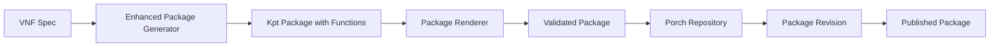

# Enhanced Nephio Architecture Integration for O-RAN Intent-MANO

This enhanced Nephio integration provides a production-ready, comprehensive package-based deployment system that follows Nephio best practices for O-RAN network function deployment and management.

## 🚀 Overview

The enhanced Nephio architecture integration transforms the O-RAN Intent-MANO system into a fully-compliant Nephio deployment platform with the following capabilities:

- **Production-Ready Package Generation**: Enhanced Kpt package creation with proper functions and validation
- **Porch Repository Management**: Complete lifecycle management of Porch repositories and package revisions
- **Advanced Package Rendering**: Kpt function pipeline execution with comprehensive validation
- **Nephio Workload API**: Full CRD implementation following Nephio patterns
- **ConfigSync Integration**: Complete GitOps workflow with automatic synchronization
- **Deployment Validation**: Comprehensive validation framework for deployed workloads
- **Production Error Handling**: Robust error handling with recovery suggestions
- **Comprehensive Testing**: Full integration test suite with mocks and end-to-end scenarios

## 📋 Architecture Components

### 1. Enhanced Package Generator
**Location**: `pkg/generator/enhanced_package_generator.go`

**Features**:
- **Production-Ready Kpt Packages**: Generates fully-compliant Kpt packages with proper function pipelines
- **Enhanced Kptfile Generation**: Complete Kptfile with mutators, validators, and inventory management
- **Advanced Resource Generation**: Kubernetes resources with O-RAN-specific annotations and labels
- **VNF-Specific Templates**: Tailored templates for RAN, CN, and TN network functions
- **Validation Rules**: Built-in validation rules for O-RAN compliance
- **Dependency Management**: Automatic dependency resolution and management

**Key Improvements**:
```go
// Enhanced package with full Nephio capabilities
type EnhancedPackage struct {
    Name            string
    Kptfile         *EnhancedKptfile
    Resources       []EnhancedResource
    Functions       []KptFunction
    Dependencies    []PackageDependency
    ValidationRules []ValidationRule
    RenderStatus    RenderStatus
}

// Production-ready Kptfile with full pipeline
type EnhancedKptfile struct {
    Pipeline   KptfilePipeline
    Inventory  *KptfileInventory
    Upstream   *KptfileUpstream
}
```

### 2. Porch Repository Manager
**Location**: `pkg/porch/repository_manager.go`

**Features**:
- **Repository Lifecycle Management**: Create, update, delete, and manage Porch repositories
- **Package Revision Management**: Handle package revisions, proposals, and publishing
- **Git and OCI Support**: Support for both Git and OCI-based repositories
- **Branch Management**: Create and manage branches for package development
- **Multi-Repository Operations**: Manage multiple repositories across clusters

**Key Capabilities**:
```go
// Comprehensive repository management
func (rm *RepositoryManager) CreateRepository(ctx context.Context, repo *Repository) error
func (rm *RepositoryManager) CreatePackageRevision(ctx context.Context, pr *PackageRevision) error
func (rm *RepositoryManager) ProposePackageRevision(ctx context.Context, name, namespace string) error
func (rm *RepositoryManager) PublishPackageRevision(ctx context.Context, name, namespace string) error
```

### 3. Package Renderer
**Location**: `pkg/renderer/package_renderer.go`

**Features**:
- **Kpt Function Execution**: Execute Kpt function pipelines with proper error handling
- **Package Validation**: Comprehensive validation of rendered packages
- **Kustomize Integration**: Full integration with kustomize for package building
- **Function Registry**: Manage and execute Kpt functions with proper configuration
- **Render History**: Track rendering history and results

**Key Features**:
```go
// Production-ready package rendering
func (r *PackageRenderer) RenderPackage(ctx context.Context, packagePath string, options *RenderOptions) (*RenderResult, error)
func (r *PackageRenderer) RenderPackageWithKustomize(ctx context.Context, packagePath string) (*RenderResult, error)
func (r *PackageRenderer) ExecuteFunction(ctx context.Context, fn *KptFunction, packagePath string) error
```

### 4. Nephio Workload API
**Location**: `api/workload/v1alpha1/types.go`

**Features**:
- **WorkloadIdentity CRD**: Complete CRD for Nephio workload management
- **WorkloadCluster CRD**: Cluster management and capabilities definition
- **Comprehensive Specs**: Full specification with QoS, placement, security, and scaling
- **Status Tracking**: Detailed status tracking with conditions and metrics
- **O-RAN Integration**: Specific annotations and labels for O-RAN compliance

**Key CRDs**:
```go
// Complete WorkloadIdentity CRD
type WorkloadIdentity struct {
    Spec   WorkloadIdentitySpec
    Status WorkloadIdentityStatus
}

// Comprehensive specification
type WorkloadIdentitySpec struct {
    VNFType           string
    Placement         PlacementSpec
    QoS              QoSSpec
    Resources        ResourceSpec
    NetworkInterfaces []NetworkInterface
    SecurityPolicy   *SecurityPolicy
    Scaling          *ScalingSpec
}
```

### 5. ConfigSync Manager
**Location**: `pkg/configsync/configsync_manager.go`

**Features**:
- **RootSync Management**: Complete RootSync lifecycle management
- **RepoSync Management**: Namespace-scoped RepoSync management
- **Multi-Cluster Support**: Deploy configurations across multiple clusters
- **Sync Status Monitoring**: Monitor and report synchronization status
- **GitOps Workflow**: Complete GitOps workflow with automatic reconciliation

**Key Operations**:
```go
// Complete ConfigSync management
func (csm *ConfigSyncManager) CreateNephioRootSync(ctx context.Context, clusterName, repoURL, branch, directory string) error
func (csm *ConfigSyncManager) CreateNephioRepoSync(ctx context.Context, namespace, repoURL, branch, directory string) error
func (csm *ConfigSyncManager) WaitForSync(ctx context.Context, name, namespace, syncType string, timeout time.Duration) error
```

### 6. Deployment Validator
**Location**: `pkg/validation/deployment_validator.go`

**Features**:
- **Comprehensive Validation**: Validate deployments, services, networking, resources, QoS, and security
- **O-RAN Specific Checks**: Validate O-RAN-specific requirements and configurations
- **Multi-Level Validation**: Support for different validation levels and severity
- **Detailed Reporting**: Comprehensive validation reports with suggestions
- **Configurable Policies**: Configurable validation policies and thresholds

**Validation Types**:
```go
// Comprehensive validation framework
func (dv *DeploymentValidator) ValidateDeployment(ctx context.Context, spec *DeploymentValidationSpec) (*ValidationResult, error)

// Multiple validation types
const (
    ValidationTypeDeployment    = "deployment"
    ValidationTypeService       = "service"
    ValidationTypeNetworking    = "networking"
    ValidationTypeResource      = "resource"
    ValidationTypeQoS           = "qos"
    ValidationTypeSecurity      = "security"
)
```

### 7. Production Error Handling
**Location**: `pkg/errors/error_handling.go`

**Features**:
- **Structured Error Handling**: Comprehensive error structure with codes, severity, and context
- **Error Recovery**: Built-in recovery suggestions and retry mechanisms
- **Error Aggregation**: Collect and combine multiple errors
- **Contextual Information**: Rich context including VNF type, cluster, and operation details
- **Observability**: Full observability with traces, metrics, and correlation IDs

**Error Structure**:
```go
// Production-ready error handling
type NephioError struct {
    Code        ErrorCode
    Severity    ErrorSeverity
    Category    ErrorCategory
    Context     ErrorContext
    Details     ErrorDetails
    Recovery    RecoveryInfo
    StackTrace  []StackFrame
}
```

### 8. Comprehensive Testing
**Location**: `test/integration/nephio_integration_test.go`

**Features**:
- **Integration Test Suite**: Complete integration tests for all components
- **Mock Implementations**: Comprehensive mocks for external dependencies
- **End-to-End Testing**: Full end-to-end workflow testing
- **Test Environment**: Automated test environment setup with envtest
- **Scenario Coverage**: Multiple test scenarios covering success and failure cases

## 🔧 Usage Examples

### Generate Enhanced Package
```go
// Create enhanced package generator
generator := generator.NewEnhancedPackageGenerator(
    templateRegistry,
    outputDir,
    "nephio",
    functionRegistry,
    validator,
)

// Generate production-ready package
pkg, err := generator.GenerateEnhancedPackage(ctx, &generator.VNFSpec{
    Name:    "ran-workload",
    Type:    "RAN",
    Version: "v1.0.0",
    QoS: generator.QoSRequirements{
        Bandwidth:  100.0,
        Latency:    10.0,
        SliceType:  "URLLC",
    },
    Placement: generator.PlacementSpec{
        CloudType: "edge",
        Site:      "edge01",
    },
}, generator.TemplateTypeKpt)
```

### Manage Porch Repository
```go
// Create repository manager
repoManager, err := porch.NewRepositoryManager(config, namespace, "main")

// Create Git repository
repo := &porch.Repository{
    Name: "ran-packages",
    Type: porch.RepositoryTypeGit,
    GitConfig: &porch.GitConfig{
        Repo:   "https://github.com/org/ran-packages.git",
        Branch: "main",
        Auth:   porch.GitAuthTypeToken,
    },
}

err = repoManager.CreateRepository(ctx, repo)
```

### Setup ConfigSync
```go
// Create ConfigSync manager
configSyncManager, err := configsync.NewConfigSyncManager(config, "config-management-system")

// Create Nephio RootSync
err = configSyncManager.CreateNephioRootSync(
    ctx,
    "edge01",                    // cluster name
    "https://github.com/org/configs.git", // repository
    "main",                      // branch
    "clusters",                  // directory
)

// Wait for sync completion
err = configSyncManager.WaitForSync(ctx, "nephio-edge01", "config-management-system", "RootSync", 5*time.Minute)
```

### Validate Deployment
```go
// Create deployment validator
validator, err := validation.NewDeploymentValidator(config, validation.DefaultValidationConfig())

// Validate deployment
result, err := validator.ValidateDeployment(ctx, &validation.DeploymentValidationSpec{
    Namespace: "ran-workloads",
    LabelSelector: map[string]string{
        "oran.io/vnf-type": "RAN",
    },
    VNFType:   "RAN",
    CloudType: "edge",
})

// Check validation results
if !result.Valid {
    for _, error := range result.Errors {
        log.Printf("Validation error: %s", error.Message)
    }
}
```

## 🏗️ Integration Workflow

### 1. Package Generation and Publishing


### 2. GitOps Deployment


## 📊 Key Benefits

### Production Readiness
- **Robust Error Handling**: Comprehensive error handling with recovery mechanisms
- **Comprehensive Testing**: Full test coverage with integration and end-to-end tests
- **Observability**: Built-in logging, metrics, and tracing
- **Documentation**: Complete API documentation and usage examples

### Nephio Compliance
- **Standard APIs**: Uses standard Nephio APIs and patterns
- **Kpt Best Practices**: Follows Kpt package best practices
- **Porch Integration**: Full integration with Porch for package management
- **ConfigSync Workflow**: Standard GitOps workflow with ConfigSync

### O-RAN Optimization
- **VNF-Specific Templates**: Optimized templates for RAN, CN, and TN functions
- **QoS Integration**: Built-in QoS validation and management
- **Multi-Site Support**: Support for edge, regional, and central deployments
- **Network Function Lifecycle**: Complete lifecycle management for network functions

### Scalability and Reliability
- **Multi-Cluster Support**: Deploy across multiple clusters
- **Async Operations**: Non-blocking operations with proper error handling
- **Resource Optimization**: Efficient resource utilization and management
- **High Availability**: Support for high-availability deployments

## 🔍 Monitoring and Observability

The enhanced integration provides comprehensive monitoring capabilities:

- **Package Generation Metrics**: Track package generation success/failure rates
- **Deployment Validation Metrics**: Monitor validation scores and compliance
- **ConfigSync Status**: Real-time sync status and error reporting
- **Resource Utilization**: Track resource usage across deployments
- **QoS Metrics**: Monitor QoS compliance and violations

## 🚀 Getting Started

1. **Install Dependencies**:
   ```bash
   # Install Nephio and dependencies
   kubectl apply -f https://github.com/nephio-project/nephio/releases/latest/download/nephio.yaml

   # Install Porch
   kubectl apply -f https://github.com/GoogleContainerTools/kpt/releases/latest/download/porch.yaml

   # Install ConfigSync
   kubectl apply -f https://github.com/GoogleCloudPlatform/anthos-config-management/releases/latest/download/config-sync.yaml
   ```

2. **Deploy Enhanced Integration**:
   ```bash
   # Build and deploy the enhanced Nephio integration
   make build
   make deploy
   ```

3. **Create Your First Package**:
   ```bash
   # Use the enhanced generator to create a package
   ./nephio-generator generate --vnf-type RAN --cloud-type edge --output ./packages/
   ```

4. **Deploy and Validate**:
   ```bash
   # Deploy via ConfigSync and validate
   ./nephio-generator deploy --package ./packages/ran-edge-package
   ./nephio-generator validate --namespace ran-workloads
   ```

This enhanced Nephio architecture integration provides a comprehensive, production-ready solution for O-RAN network function deployment that follows Nephio best practices while being optimized for O-RAN-specific requirements.